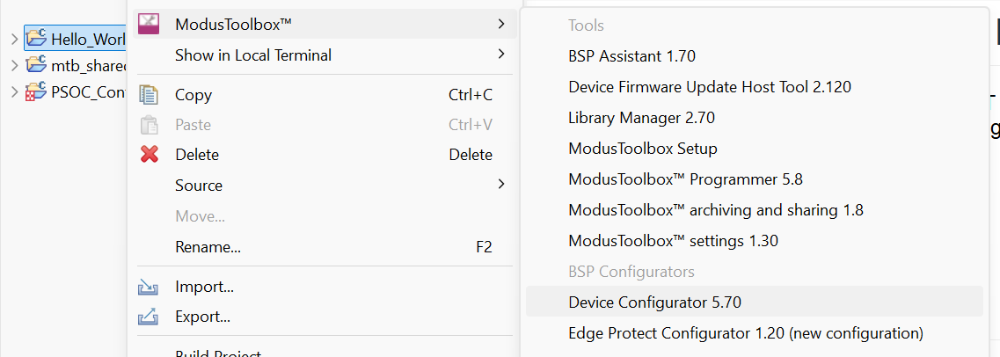
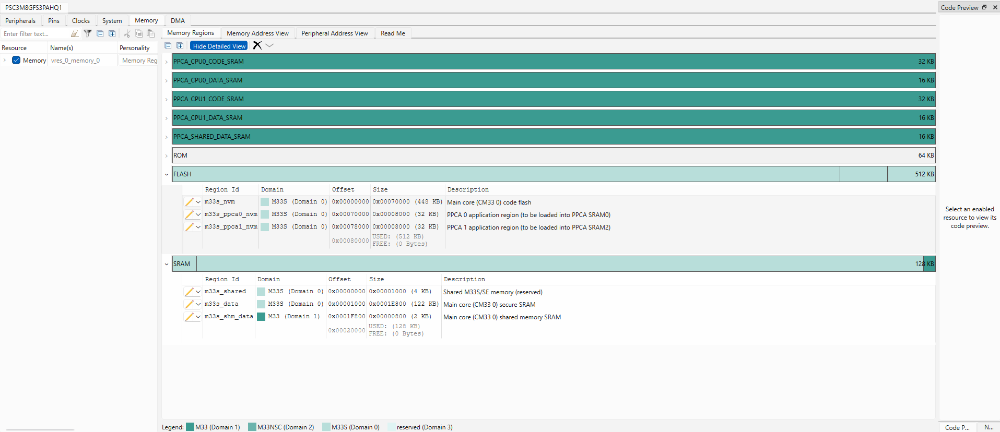
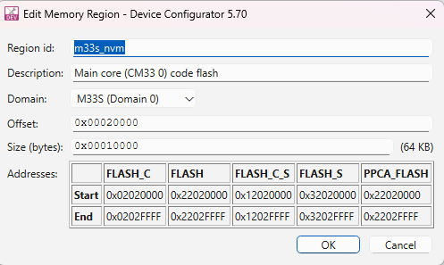

# PSOC™ Control C3P(M)8 MCU: EdgeProtect Bootloader

Edge protect bootloader is an [MCUBoot](https://github.com/mcu-tools/mcuboot) based solution adapted for Infineon 32-bit PSOC™ Arm® Cortex®-M33 MCUs. This document provides platform-specific information for the PSOC™ Control C3P8 device (PSC3_P(M)8 platform).

## Table of Contents

- [Requirements](#requirements)
- [Supported toolchains (make variable 'TOOLCHAIN')](#supported-toolchains-make-variable-toolchain)
- [Supported kits (make variable 'TARGET')](#supported-kits-make-variable-target)
- [Hardware setup](#hardware-setup)
- [Software Setup](#software-setup)
  - [Preparing the Project](#preparing-the-project)
- [Getting Started](#getting-started)
  - [Create the Project](#create-the-project)
  - [Open the Project](#open-the-project)
- [Debugging](#debugging)
- [Build System](#build-system)
  - [Building the Bootloader](#building-the-bootloader)
  - [Key Build Variables](#key-build-variables)
  - [Toolchain and Build Configuration](#toolchain-and-build-configuration)
  - [Common Build Notes](#common-build-notes)
  - [Configuration Details](#configuration-details)
- [Quick Start Guide](#quick-start-guide)
  - [Memory Map Alignment](#memory-map-alignment)
  - [Step 1: Prerequisites](#step-1-prerequisites)
  - [Step 2: Choose Your Upgrade Mode](#step-2-choose-your-upgrade-mode)
  - [Step 3: Build and Program Bootloader](#step-3-build-and-program-bootloader)
  - [Step 4: Build, Sign, and Program User Application](#step-4-build-sign-and-program-user-application)
  - [Step 5: Test and Verify](#step-5-test-and-verify)
- [Feature Configuration Reference](#feature-configuration-reference)
  - [How to Configure and Build](#how-to-configure-and-build)
  - [Quick Reference Table](#quick-reference-table)
  - [Image Validation and Signing](#image-validation-and-signing)
  - [Hardware Rollback Protection](#hardware-rollback-protection)
  - [Software Downgrade Prevention](#software-downgrade-prevention)
  - [SFLASH Key Storage](#sflash-key-storage)
  - [Image Encryption](#image-encryption)
    - [KDF-CMAC Encryption (Hardware)](#kdf-cmac-encryption-hardware)
    - [EC256 Encryption (Software)](#ec256-encryption-software)
  - [Dependency Check](#dependency-check)
  - [Fault Injection Hardening](#fault-injection-hardening)
  - [Logging Configuration](#logging-configuration)
  - [Configuring the bootloader for Production Lifecycle Stage (LCS)](#configuring-the-bootloader-for-production-lifecycle-stage-lcs)
- [Design and implementation](#design-and-implementation)
  - [Resources and settings](#resources-and-settings)
- [Related resources](#related-resources)
- [Other resources](#other-resources)
- [Document history](#document-history)

## Requirements

- [ModusToolbox&trade;](https://www.infineon.com/modustoolbox) v3.9.0 or later (tested with v3.9.0)
- [ModusToolbox™ Edge Protect Security Suite](https://softwaretools.infineon.com/tools/com.ifx.tb.tool.modustoolboxedgeprotectsecuritysuite) v2.3.0 or later
- Board support package (BSP) minimum required version: 2.2.0
- Associated parts: All [PSOC&trade; Control C3 MCUs](https://www.infineon.com/cms/en/product/microcontroller/32-bit-psoc-arm-cortex-microcontroller/32-bit-psoc-control-arm-cortex-m33-mcu/)
- [Python](https://www.python.org/downloads) 3.11 or later

## Supported toolchains (make variable 'TOOLCHAIN')

- GNU Arm® Embedded Compiler v14.2.1 (`GCC_ARM`) – Default value of `TOOLCHAIN`
- Arm® Compiler v6.22 (`ARM`)
- IAR C/C++ Compiler v9.70.4 (`IAR`)

## Supported kits (make variable 'TARGET')

- [PSOC™ Control C3M8 MCU Evaluation Kit](https://www.infineon.com/KIT_PSC3M8_EVK) (`KIT_PSC3M8_EVK`) – Default value of `TARGET`
- [PSOC™ Control C3M8 Digital Power Control Card](https://www.infineon.com/KIT_PSC3M8_CC1) (`KIT_PSC3M8_CC1`)

## Hardware setup

This example uses the board's default configuration. See the kit user guide to ensure that the board is configured correctly.

## Software Setup

See the [ModusToolbox™ tools package installation guide](https://www.infineon.com/ModusToolboxInstallguide) for information about installing and configuring the tools package.

Install a terminal emulator if you don't have one. Instructions in this document use [Tera Term](https://teratermproject.github.io/index-en.html).

This example requires no additional software or tools.

### Preparing the Project

Before using the code example, ensure that the `PATH` environment variable is updated to include the path to the `edgeprotecttools` executable. This tool is required for signing the application and is available as part of the **Edge Protect Security Suite**.

To add the tool to your `PATH`:

1. Locate the `edgeprotecttools` executable. It is typically found in the following directory:
   ```plaintext
   <security_suite_path>/tools/edgeprotecttools/bin
   ```
   Replace `<security_suite_path>` with the installation path of the Edge Protect Security Suite.

2. Add this path to the `PATH` environment variable.

3. Verify the setup:
   - Open a terminal or command prompt and run:
     ```bash
     edgeprotecttools version
     ```
   - If the tool is correctly added to the `PATH`, this command will display the version of `edgeprotecttools`.

By completing this step, you ensure that the required tools are accessible for signing and preparing the application.

   > **Note:** If you encounter a "/bin/sh: line 1: ..." warning during compilation, the Edge Protect Tools are likely not configured or configured incorrectly.

## Getting Started

### Create the Project

The ModusToolbox™ tools package provides the Project Creator as both a GUI tool and a command line tool.

#### Use Project Creator GUI

1. Open the Project Creator GUI tool.

   There are several ways to do this, including launching it from the dashboard or from inside the Eclipse IDE. For more details, see the [Project Creator user guide](https://www.infineon.com/ModusToolboxProjectCreator) (locally available at *{ModusToolbox™ install directory}/tools_{version}/project-creator/docs/project-creator.pdf*).

2. On the **Choose Board Support Package (BSP)** page, select a kit supported by this code example. See [Supported kits](#supported-kits-make-variable-target) for the list.

   > **Note:** To use this code example for a kit not listed here, you may need to update the source files. If the kit does not have the required resources, the application may not work.

3. On the **Select Application** page:

   a. Select the **Application(s) Root Path** and the **Target IDE**.

      > **Note:** Depending on how you open the Project Creator tool, these fields may be pre-selected for you.

   b. Select this code example from the list by enabling its check box.

      > **Note:** You can narrow the list of displayed examples by typing in the filter box.

   c. (Optional) Change the suggested **New Application Name** and **New BSP Name**.

   d. Click **Create** to complete the application creation process.

#### Use Project Creator CLI

The 'project-creator-cli' tool can be used to create applications from a CLI terminal or from within batch files or shell scripts. This tool is available in the *{ModusToolbox™ install directory}/tools_{version}/project-creator/* directory.

Use a CLI terminal to invoke the 'project-creator-cli' tool. On Windows, use the command-line 'modus-shell' program provided in the ModusToolbox™ installation instead of a standard Windows command-line application. This shell provides access to all ModusToolbox™ tools. You can access it by typing "modus-shell" in the search box in the Windows menu. In Linux and macOS, you can use any terminal application.

The following example clones the "[mtb-example-psoc-control-edge-protect-bootloader](https://github.com/Infineon/mtb-example-psoc-control-edge-protect-bootloader)" application with the desired name "EdgeProtectBootloader" configured for the *KIT_PSC3M8_EVK* BSP into the specified working directory, *C:/mtb_projects*:

```bash
project-creator-cli --board-id KIT_PSC3M8_EVK --app-id mtb-example-psoc-control-edge-protect-bootloader --user-app-name EdgeProtectBootloader --target-dir "C:/mtb_projects"
```

The 'project-creator-cli' tool has the following arguments:

<table>
  <tr>
    <th>Argument</th>
    <th>Description</th>
    <th>Required/optional</th>
  </tr>
  <tr>
    <td><code>--board-id</code></td>
    <td>Defined in the \<id> field of the <a href="https://github.com/Infineon?q=bsp-manifest&type=&language=&sort=">BSP</a> manifest</td>
    <td>Required</td>
  </tr>
  <tr>
    <td><code>--app-id</code></td>
    <td>Defined in the \<id> field of the <a href="https://github.com/Infineon?q=ce-manifest&type=&language=&sort=">CE</a> manifest</td>
    <td>Required</td>
  </tr>
  <tr>
    <td><code>--target-dir</code></td>
    <td>Specify the directory in which the application is to be created if you prefer not to use the default current working directory</td>
    <td>Optional</td>
  </tr>
  <tr>
    <td><code>--user-app-name</code></td>
    <td>Specify the name of the application if you prefer to have a name other than the example's default name</td>
    <td>Optional</td>
  </tr>
</table>

> **Note:** The project-creator-cli tool uses the `git clone` and `make getlibs` commands to fetch the repository and import the required libraries. For details, see the "Project creator tools" section of the [ModusToolbox™ tools package user guide](https://www.infineon.com/ModusToolboxUserGuide) (locally available at {ModusToolbox™ install directory}/docs_{version}/mtb_user_guide.pdf).

### Open the Project

After the project has been created, you can open it in your preferred development environment.

#### Eclipse IDE

If you open the Project Creator tool from the included Eclipse IDE, the project will open in Eclipse automatically.

For more details, see the [Eclipse IDE for ModusToolbox™ user guide](https://www.infineon.com/MTBEclipseIDEUserGuide) (locally available at *{ModusToolbox™ install directory}/docs_{version}/mt_ide_user_guide.pdf*).

#### Visual Studio (VS) Code

Launch VS Code manually, and then open the generated *{project-name}.code-workspace* file located in the project directory.

For more details, see the [Visual Studio Code for ModusToolbox™ user guide](https://www.infineon.com/MTBVSCodeUserGuide) (locally available at *{ModusToolbox™ install directory}/docs_{version}/mt_vscode_user_guide.pdf*).

#### Keil µVision

Double-click the generated *{project-name}.cprj* file to launch the Keil µVision IDE.

For more details, see the [Keil µVision for ModusToolbox™ user guide](https://www.infineon.com/MTBuVisionUserGuide) (locally available at *{ModusToolbox™ install directory}/docs_{version}/mt_uvision_user_guide.pdf*).

#### IAR Embedded Workbench

Open IAR Embedded Workbench manually, and create a new project. Then select the generated *{project-name}.ipcf* file located in the project directory.

For more details, see the [IAR Embedded Workbench for ModusToolbox™ user guide](https://www.infineon.com/MTBIARUserGuide) (locally available at *{ModusToolbox™ install directory}/docs_{version}/mt_iar_user_guide.pdf*).

##### Additional Setup for Bootloader

Bootloader is a secure (TrustZone) application. Because of this, a few extra steps are required when working with IAR EWARM IDE to make sure the project is exported and configured correctly before building.

1. **Set the target core.**
   After creating the project and adding the project connection, in IAR Embedded Workbench, open **Project → Options → General Options → Target** and set:
   - **Core:** `Cortex-M33`

2. **Enable TrustZone and select the Secure mode.**
   In **Project → Options → General Options → 32-bit**:
   - Enable the **TrustZone** checkbox.
   - Set the TrustZone mode to **Secure**.


#### Command line

If you prefer to use the CLI, open the appropriate terminal, and navigate to the project directory. On Windows, use the command-line 'modus-shell' program; on Linux and macOS, you can use any terminal application. From there, you can run various `make` commands.

For more details, see the [ModusToolbox™ tools package user guide](https://www.infineon.com/ModusToolboxUserGuide) (locally available at *{ModusToolbox™ install directory}/docs_{version}/mtb_user_guide.pdf*).

## Debugging

You can debug the example to step through the code.

### In Eclipse IDE

Use the **\<Application Name> Debug (KitProg3_MiniProg4)** configuration in the **Quick Panel**. For details, see the "Program and debug" section in the [Eclipse IDE for ModusToolbox™ user guide](https://www.infineon.com/MTBEclipseIDEUserGuide).

### In other IDEs

Follow the instructions in your preferred IDE.

## Build System

### Building the Bootloader

**Basic Build (Uses Default Configuration):**
```bash
cd bootloader
make clean_proj
make build_proj
```
This uses default settings from `common.mk`: default `TARGET` and `MEMORY_MAP`.

**Custom Build Example:**

```bash
# Specify target, memory map, and feature config
make build_proj \
    TARGET=APP_KIT_PSC3M8_EVK \
    MEMORY_MAP=../platforms/PSC3_P8/memory_maps/overwrite_single_flash.json \
    FEATURE_CONFIG=../platforms/PSC3_P8/feature_config.json
```

### Key Build Variables

| Variable | Purpose | Default Location |
|----------|---------|------------------|
| `TARGET` | Specifies the kit/board | Defined in `common.mk` |
| `MEMORY_MAP` | Memory layout JSON (addresses, slots) | `platforms/PSC3_P8/memory_maps/` |
| `FEATURE_CONFIG` | Security and feature settings | `platforms/PSC3_P8/feature_config.json` |

**Memory Map Options:**
- `overwrite_single_flash.json` - Single app, overwrite upgrade
- `swap_single_flash.json` - Single app, swap upgrade
- `overwrite_multi2_flash.json` - Two apps, overwrite upgrade
- `swap_multi2_flash.json` - Two apps, swap upgrade

> **Note:** The bootloader and application must use the same upgrade strategy (overwrite or swap).

---

### Toolchain and Build Configuration

#### Selecting a Toolchain

The bootloader supports three toolchains. The default is set in `common.mk`:

| Toolchain | Value |
|-----------|-------|
| **GCC ARM** | `GCC_ARM` |
| **ARM Compiler** | `ARM` |
| **IAR** | `IAR` |

**To change the toolchain:**

**Option 1: Edit `common.mk`** (Permanent change)
```makefile
# Find this line in common.mk
TOOLCHAIN=GCC_ARM

# Change to your desired toolchain
TOOLCHAIN=ARM
```

**Option 2: Command line override** (One-time build)
```bash
# Build with ARM compiler
make build_proj TOOLCHAIN=ARM
```

#### Build Configuration (Debug vs Release)

The build optimization level is controlled by the `CONFIG` variable in `common_app.mk`:

| Configuration | Debug Symbols |
|---------------|---------------|
| `Debug` | Full |
| `Release` | Minimal |
| `Custom` | Configurable |

**To change the build configuration:**

**Option 1: Edit `common_app.mk`** (Permanent change)
```makefile
# Find this line in common_app.mk
CONFIG=Debug

# Change to Release for production builds
CONFIG=Release
```

**Option 2: Command line override** (One-time build)
```bash
# Build release version
make build_proj CONFIG=Release
```

**Combined Examples:**

```bash
# Release build with ARM compiler
make build_proj TOOLCHAIN=ARM CONFIG=Release

# Debug build with IAR for specific target
make build_proj TOOLCHAIN=IAR CONFIG=Debug TARGET=APP_KIT_PSC3M8_CC1

# Complete custom build
make build_proj \
    TOOLCHAIN=ARM \
    CONFIG=Release \
    TARGET=APP_KIT_PSC3M8_EVK \
    MEMORY_MAP=../platforms/PSC3_P8/memory_maps/swap_single_flash.json
```

> **Important:** If you change `CONFIG` manually, remember to update or regenerate launch configurations for your IDE.

---

### Common Build Notes

**GCC Warning (Safe to Ignore):**
The warning `bootloader.elf has a LOAD segment with RWX permissions` may appear with GCC 12+.

**To suppress this warning:**
- **Do not** use `LDFLAGS += -Wl,--no-warn-rwx-segments` from the command line, as it will override the `LDFLAGS` defined in `bootloader/app.mk`
- **Instead**, add the flag directly to `bootloader/app.mk`:
  ```makefile
  LDFLAGS += -Wl,--no-warn-rwx-segments
  ```
  This preserves existing linker flags while suppressing the warning.

See: [GCC 14 warnings](https://community.infineon.com/t5/Knowledge-Base-Articles/GCC-14-warnings-when-using-ModusToolbox/ta-p/1044532)

---

### Configuration Details

<details>
<summary><b>Click to expand: Project Configuration Files</b></summary>

**Root Level:**
- `common.mk` - Configures default `TARGET` and `MEMORY_MAP`
- `common_app.mk` - Variables common to all projects

**Platform Specific** (`platforms/PSC3_P8/`):
- `feature_config.json` - Security and feature settings (edit this for customization)
- `feature_config.mk` - Auto-generated from JSON (don't edit manually)
- `platform.mk` - Platform-specific variables

**Application Level:**
- `app.mk` - Application-specific makefile

</details>

<details>
<summary><b>Click to expand: Memory Map Details</b></summary>

**Location:** `platforms/PSC3_P8/memory_maps/`

**Naming Convention:**
`<strategy>_<num_apps>_<storage>.json`

Examples:
- `overwrite_single_flash.json` - Overwrite strategy, 1 app, internal flash
- `swap_multi2_flash.json` - Swap strategy, 2 apps, internal flash

**What it defines:**
- Bootloader address range
- Application slot addresses
- Upgrade slot addresses
- `BOOT_MODE` variable
- `APPTYPE` variable (XIP, RAM, etc.)

The memory map is processed by a Python script to generate C source files with memory layout configurations.

</details>

---

## Quick Start Guide

This guide shows how to build and run the bootloader with a user application using **default settings**. Choose between **Overwrite** or **Swap** upgrade modes based on your requirements.

### Memory Map Alignment

Before configuring your application, you need to understand where the addresses come from:

**The bootloader's memory layout is defined in:**
```
PSOC_Edge_Protect_Bootloader/platforms/PSC3_P8/memory_maps/overwrite_single_flash.json
```

**Key addresses from this file:**

| Address | Purpose | Defined In Memory Map |
|---------|---------|----------------------|
| `0x32000000` | Bootloader start | `"address"` in bootloader section |
| `0x32020000` | **Application slot start** | `"address"` in primary_1 section |
| `0x10000` (64KB) | Application slot size | `"size"` in primary_1 section |
| `0x34001000` | **RAM start for application** | `"address"` in ram section |
| `0xE000` (56KB) | RAM size for application | `"size"` in ram section |

**Why this matters:**
- The bootloader is configured to look for your application at `0x32020000`
- Your application's linker script must place the vector table at `0x32020400` (slot start + 0x400 header)
- The RAM region (`0x34001000` - `0x3400F000`) is reserved for your application's data and stack
- If addresses don't match, the bootloader won't find your application or will jump to the wrong location

**To view your current memory map:**

```bash
# Open the memory map file
cat PSOC_Edge_Protect_Bootloader/platforms/PSC3_P8/memory_maps/overwrite_single_flash.json

# Look for the "slots" section:
"slots":
{
  "boot"    : "0x32020000", ← Boot slot address
  "upgrade" : "0x32040000", ← Upgrade slot
  "size"    : "0x10000"     ← Slot size (64KB)
}

# Look for the "ram" section:
"ram":
{
  "address" : "0x34001000", ← RAM start for your app
  "size"    : "0xE000"      ← RAM size (56KB)
}
```

> **Note:** If you modify the memory map (e.g., changing slot addresses or sizes), you **must** update your application's linker script to match the new addresses. Always keep these synchronized!

---

### Step 1: Prerequisites

Create both projects using ModusToolbox™:

1. **Edge Protect Bootloader** - From the New Application wizard
2. **Your User Application** - From the New Application wizard

### Step 2: Choose Your Upgrade Mode

The bootloader supports two upgrade strategies. Choose one before proceeding:

#### Overwrite Mode (Simpler, Faster)

**How it works:** New firmware directly overwrites the old version in the primary slot.

**Memory Map:** `overwrite_single_flash.json`

| Component | Address | Size |
|-----------|---------|------|
| Bootloader | 0x32000000 | 96 KB |
| Primary Slot (your app runs here) | 0x32020000 | 64 KB |
| Secondary Slot (upgrade staging) | 0x32040000 | 64 KB |

---

#### Swap Mode (Safer, Rollback Support)

**How it works:** New firmware is written to secondary slot, then bootloader swaps primary ↔ secondary. If new firmware fails, bootloader can swap back.

**Memory Map:** `swap_single_flash.json`

| Component | Address | Size |
|-----------|---------|------|
| Bootloader | 0x32000000 | 128 KB |
| Primary Slot (your app runs here) | 0x32020000 | 64 KB |
| Secondary Slot (upgrade staging) | 0x32040000 | 64 KB |
| Scratch Area (swap buffer) | 0x32038000 | 8 KB |
| Status Area (swap state) | 0x3203A000 | 10 KB |

---

### Step 3: Build and Program Bootloader

#### 3.1 Memory Map Alignment

Edit `PSOC_Edge_Protect_Bootloader/common.mk` to set your chosen memory map:

<details open>
<summary><b>For Overwrite Mode</b></summary>

Find this line:
```makefile
MEMORY_MAP ?= ../platforms/$(PLATFORM)/memory_maps/overwrite_single_flash.json
```

Leave it as-is (overwrite is the default) or select another overwrite map.

</details>

<details>
<summary><b>For Swap Mode</b></summary>

Find this line:
```makefile
MEMORY_MAP ?= ../platforms/$(PLATFORM)/memory_maps/overwrite_single_flash.json
```

Change it to:
```makefile
MEMORY_MAP ?= ../platforms/$(PLATFORM)/memory_maps/swap_single_flash.json
```

</details>

#### 3.2 Build Bootloader

See [Building the Bootloader](#building-the-bootloader) for detailed build instructions and customization options.

**Verify build success:**
- Look for `Build complete` message
- Find bootloader hex: `build/APP_KIT_PSC3M8_EVK/Debug/bootloader.hex`

#### 3.3 Program Bootloader

**Option A: Using Eclipse IDE**
- Select `PSOC_Edge_Protect_Bootloader` in Project Explorer
- **Quick Panel** → **Launches** → **PSOC_Edge_Protect_Bootloader Program Application**

**Option B: Using Command Line (OpenOCD)**
```bash
openocd -s "$OPENOCD_PATH/scripts" \
    -f interface/kitprog3.cfg \
    -f target/infineon/psc3x8.cfg \
    -c "program build/APP_KIT_PSC3M8_EVK/Debug/bootloader.hex verify reset exit"
```

> **Note:** OpenOCD with KitProg3 is only supported for the `KIT_PSC3M8_EVK`. The `KIT_PSC3M8_CC1` uses a J-Link debug probe and cannot be programmed with OpenOCD. For `KIT_PSC3M8_CC1`, use a J-Link-compatible tool to program the device.

---

### Step 4: Build, Sign, and Program User Application

#### 4.1 Configure Application Addresses

The application's memory layout must match the bootloader's memory map so the bootloader can locate, validate, and launch it. The memory map (e.g., `overwrite_single_flash.json` or `swap_single_flash.json`) defines each image slot's flash address and size, along with the RAM region available to the application. If the application is linked to an address other than the slot the bootloader expects, the bootloader cannot find a valid image and fails to boot it.

##### General Concept

The bootloader places your application at a specific flash address (the primary slot). Your application's linker must be configured so that:

1. **Flash ORIGIN** = Primary slot address + MCUboot header size (0x400)
2. **Flash LENGTH** = Slot size from the memory map
3. **RAM ORIGIN and LENGTH** = RAM region from the memory map

Refer to the bootloader's memory map JSON file (for example, `overwrite_single_flash.json` or `swap_single_flash.json`) for the exact slot addresses, sizes, and RAM configuration.

##### Configure Applications

The application's linker script must be aligned with the bootloader's memory map JSON file. You can achieve this in one of three ways:

- **Update the application addresses and size with Device Configurator** to match the existing bootloader memory map (recommended for most users).
- **Modify the bootloader memory map** to match the addresses and sizes you have already fixed in your application.
- **Manually edit or create a custom linker script** to define memory regions that match the bootloader's memory map.

##### Option 1: Update Application Addresses with Device Configurator

Device Configurator is the recommended way to set the application's memory regions, because it regenerates the linker script for you and keeps all supported toolchains in sync. Use this option to make your application's flash and RAM regions match the slot and RAM addresses defined in the bootloader's memory map.

> **Note:** The screenshots below are taken from the **Hello World** code example and are provided for illustration. Your application name and existing values will differ; apply the same steps to your own project.

1. **Open your application in Device Configurator.**

   

2. **Navigate to the Memory Regions section.** Open **Memory → Memory Regions** to see the flash and RAM regions defined for your application.

   

3. **Edit the memory region you need and verify the addresses.** Set the flash region to the application slot address (including the header offset) and size, and set the RAM region to match the memory map. Confirm the addresses shown in the region match the memory map for the application slot you intend to use (for example, the primary slot at `0x32020000`).

   

4. **Save the configuration and rebuild your application.** Device Configurator automatically regenerates the linker script with the new addresses.

##### Option 2: Modify the Bootloader Memory Map

If your application already has fixed parameters that you do not want to change, adjust the bootloader instead so that its slots match your application.

1. Open the memory map JSON used by your bootloader build (in `platforms/PSC3_P8/memory_maps/`, for example `overwrite_single_flash.json`).
2. Update the slot's `boot` or `upgrade` address (whichever your application uses), the slot `size`, and the `ram` region so they correspond to the addresses set in your application's linker script.
3. Rebuild the bootloader so the new memory map is regenerated and compiled.

After rebuilding, program the updated bootloader and confirm the boot log reports the expected `Start slot Address`.

##### Option 3: Manually Edit or Create a Custom Linker Script

You can manually edit your application's linker script or provide a custom one. Code examples typically ship with a linker script for each supported toolchain.

**Location of the linker script for the secure app (GCC example):**
```
YourApp/bsps/TARGET_<YOUR_KIT>/TOOLCHAIN_GCC_ARM/linker_s_flash.ld
```

This file defines the application's memory layout. Regardless of the specific variable names your linker script uses, it must express the following memory parameters:

- **Flash base address** — the code flash origin, set to the primary slot address plus the MCUboot header size.
- **Flash size** — the amount of code flash available to the application, taken from the slot size.
- **RAM base address** — the SRAM origin available to the application.
- **RAM size** — the amount of SRAM available to the application.

On this platform, flash may be expressed with both a C-bus (non-secure alias) and an S-bus (secure alias) address that point to the same physical memory; update both if your script defines them.

**Update these flash and RAM parameters to match the bootloader's memory map.**

> **Note:** Define your memory map first, then update the linker script to match it, and always take the addresses and sizes from the memory map JSON file you are using.

> **Note:** The linker script always targets the **primary slot** address, even when building an image destined for the upgrade (secondary) slot. This is because the bootloader moves the upgrade image into the primary slot before executing it — either by copying (overwrite mode) or swapping (swap mode). The secondary slot address is only used at **signing time** (see [Step 4.3](#43-sign-application)).

##### Custom Linker Script

If you are writing your own linker script from scratch, define the same memory parameters yourself — the slot (flash) base address and size, and the RAM base address and size — using the values from the bootloader's memory map.

##### Memory Address Constraints

Regardless of the method used, the bootloader, slot, and RAM addresses and sizes must satisfy the platform constraints below.

- **Flash range:** All flash addresses must fall within the `0x32000000`–`0x32080000` range.
- **Erase-size alignment:** Every region address and size must be a multiple of the flash erase size (`0x200`, 512 bytes by default — `PLATFORM_MIN_ERASE_SIZE` in `platform.mk`).
- **VTOR alignment:** All flash addresses must meet the Cortex-M33 VTOR alignment requirement, which on PSC3_P8 means they must be `0x400`-aligned.
- **RAM range:** The application's RAM region must match the `ram` entry in the memory map (`0x34001000`, size `0xE000` by default) and must not clobber the `0x1000` shared-data block at `0x34000000`.
- **No overlap:** The bootloader, boot slot, upgrade slot, and (in swap mode) the scratch and status areas must not overlap.

##### MCUboot Header Size

The BSP defines a build variable `MCUBOOT_HEADER_SIZE` (default: `0x0`). When used with the bootloader, set it to `0x400` in your application's Makefile or on the command line:
```makefile
MCUBOOT_HEADER_SIZE=0x400
```
This reserves 1KB at the start of flash for the MCUboot image header. The linker script uses this value in the `.mcu_boot_header` section.

> **Important notes:**
> - The 0x400 (1KB) offset reserves space for the MCUboot image header. Always add this to the slot base address.
> - RAM addresses must match the memory map to ensure proper memory allocation for your application's data and stack.

#### 4.2 Build Application

```bash
cd User_Application
make clean
make build
```

**Verify build success:**
- Look for `Build complete` message
- Find your hex: `main_cm33_s/build/APP_KIT_PSC3M8_EVK/Debug/main_cm33_s.hex`

#### 4.3 Sign Application

Even without validation, the bootloader requires the MCUboot header (1KB at slot start). 

**Common `edgeprotecttools sign-image` parameters:**

- `--image` - Path to an application that needs to be signed
- `--output` - Signed application output path
- `--header-size` - Application header size (typically 0x400 / 1KB)
- `--hex-addr` - Application slot address from memory map
- `--slot-size` - Application slot size from memory map
- `--key` - Signature private key file
- `--align` - Data alignment (use 1)
- `--image-version` - Firmware version format: `major.minor.patch`
  - `major` - Image ID (1 or 2 for multi-image)
  - `minor` - Slot type (1 for BOOT, 2 for UPGRADE)
  - `patch` - Build number (incremental)
  - Example: `1.1.0` (Image 1, BOOT slot, build 0)
- `--pad` - Fill image paddings (required for upgrade slot)
- `--erased-val` - Flash default value (use 0)
- `--min-erase-size` - Flash minimum erase size (use 0x200)
- `--overwrite-only` - Specify for overwrite upgrade mode (skip for swap mode)
- `--boot-record` - Boot record identifier

**To create images with MCUboot header:** Run `edgeprotecttools` with either:
- `image-metadata` - Adds header without signature
- `sign-image` - Adds header with signature (requires `--key` parameter)

Rename (or copy) the raw hex, then sign it:

```bash
# Rename raw build output
mv main_cm33_s/build/APP_KIT_PSC3M8_EVK/Debug/main_cm33_s.hex main_cm33_s/build/APP_KIT_PSC3M8_EVK/Debug/main_cm33_s_raw.hex
```

<details>
<summary><b>Sign for BOOT slot using Overwrite Mode (Click to expand command)</b></summary>

```bash
# Sign Application from PSOC_Edge_Protect_Bootloader directory for BOOT slot
edgeprotecttools sign-image \
  --image ../User_Application/main_cm33_s/build/APP_KIT_PSC3M8_EVK/Debug/main_cm33_s_raw.hex \
  --output ../User_Application/main_cm33_s/build/APP_KIT_PSC3M8_EVK/Debug/main_cm33_s.hex \
  --hex-addr 0x32020000 \
  --key keys/cypress-test-ec-p256.pem \
  --header-size 0x400 \
  --align 1 \
  --image-version 1.1.0 \
  --slot-size 0x10000 \
  --erased-val 0 \
  --min-erase-size 0x200 \
  --overwrite-only \
  --boot-record User_App
```

</details>

<details>
<summary><b>Sign for UPGRADE slot using Overwrite Mode (Click to expand command)</b></summary>

```bash
# Sign Application from PSOC_Edge_Protect_Bootloader directory for UPGRADE slot
edgeprotecttools sign-image \
  --image ../User_Application/main_cm33_s/build/APP_KIT_PSC3M8_EVK/Debug/main_cm33_s_raw.hex \
  --output ../User_Application/main_cm33_s/build/APP_KIT_PSC3M8_EVK/Debug/main_cm33_s.hex \
  --hex-addr 0x32040000 \
  --key keys/cypress-test-ec-p256.pem \
  --header-size 0x400 \
  --align 1 \
  --image-version 1.2.0 \
  --slot-size 0x10000 \
  --erased-val 0 \
  --min-erase-size 0x200 \
  --overwrite-only \
  --pad \
  --boot-record User_App
```

</details>

<details>
<summary><b>Sign for BOOT slot using Swap Mode (Click to expand command)</b></summary>

```bash
# Sign Application from PSOC_Edge_Protect_Bootloader directory for BOOT slot
edgeprotecttools sign-image \
  --image ../User_Application/main_cm33_s/build/APP_KIT_PSC3M8_EVK/Debug/main_cm33_s_raw.hex \
  --output ../User_Application/main_cm33_s/build/APP_KIT_PSC3M8_EVK/Debug/main_cm33_s.hex \
  --hex-addr 0x32020000 \
  --key keys/cypress-test-ec-p256.pem \
  --header-size 0x400 \
  --align 1 \
  --image-version 1.1.0 \
  --slot-size 0x10000 \
  --erased-val 0 \
  --min-erase-size 0x200 \
  --boot-record User_App
```

</details>

<details>
<summary><b>Sign for UPGRADE slot using Swap Mode (Click to expand command)</b></summary>

```bash
# Sign Application from PSOC_Edge_Protect_Bootloader directory for UPGRADE slot
edgeprotecttools sign-image \
  --image ../User_Application/main_cm33_s/build/APP_KIT_PSC3M8_EVK/Debug/main_cm33_s_raw.hex \
  --output ../User_Application/main_cm33_s/build/APP_KIT_PSC3M8_EVK/Debug/main_cm33_s.hex \
  --hex-addr 0x32040000 \
  --key keys/cypress-test-ec-p256.pem \
  --header-size 0x400 \
  --align 1 \
  --image-version 1.2.0 \
  --slot-size 0x10000 \
  --erased-val 0 \
  --min-erase-size 0x200 \
  --pad \
  --boot-record User_App
```

</details>

#### 4.4 Program Application

**Option A: Using Eclipse IDE**
- Select your app project in Project Explorer
- **Quick Panel** → **\<App Name> Program**

**Option B: Using Command Line (OpenOCD)**
```bash
openocd -s "$OPENOCD_PATH/scripts" \
    -f interface/kitprog3.cfg \
    -f target/infineon/psc3x8.cfg \
    -c "program build/APP_KIT_PSC3M8_EVK/Debug/app.hex verify reset exit"
```

> **Note:** OpenOCD with KitProg3 is only supported for the `KIT_PSC3M8_EVK`. The `KIT_PSC3M8_CC1` uses a J-Link debug probe and cannot be programmed with OpenOCD. For `KIT_PSC3M8_CC1`, use a J-Link-compatible tool to program the device.

---

### Step 5: Test and Verify

1. **Connect serial terminal:**
   - Port: KitProg3 COM port
   - Settings: 115200 baud, 8N1, no flow control

2. **Press RESET** on the kit

3. **Expected output:**

<details>
<summary><b>BOOT slot using Overwrite Mode (Click to expand)</b></summary>

```
[0s.0ms][INF] MCUBoot Bootloader Started
[0s.0ms][INF] boot_go_for_image_id
[0s.0ms][INF] Processing img id: 0
[0s.2ms][DBG]  * boot_prepare_image_for_update...
[0s.7ms][DBG] > boot_prepare_image_for_update: image = 0
[0s.12ms][DBG]  * Read an image (0) header from each slot: rc = 0
[0s.18ms][DBG]  * There was no partial swap, determine swap type.
[0s.24ms][INF] boot_swap_type_multi: Primary image: magic=bad, swap_type=0x1, copy_done=0x2, image_ok=0x2
[0s.33ms][INF] boot_swap_type_multi: Secondary image: magic=unset, swap_type=0x1, copy_done=0x3, image_ok=0x3
[0s.43ms][INF] Swap type: none
[0s.46ms][DBG] < boot_prepare_image_for_update
[0s.50ms][DBG]  * process swap_type = 1
[0s.54ms][INF] Since boot image validation was skipped, at least IMAGE_MAGIC should be checked
[0s.63ms][INF] Successfully added image data to shared area
[0s.68ms][INF] User Application validated successfully
[0s.73ms][INF] Running the first app
[0s.76ms][DBG]  > run_next_app: !MCUBOOT_RAM_LOAD || MCUBOOT_MULTI_MEMORY_LOAD
[0s.84ms][DBG]  > run_next_app: rc = 0, image_base = 0x32000000
[0s.89ms][INF] Starting User Application (wait)...
[0s.94ms][INF] Start slot Address: 0x32020400
[0s.98ms][INF] MCUBoot Bootloader finished.

[INF] Deinitializing hardware...

************************************************************
Your Application Output Appears Here
************************************************************
```

</details>

<details>
<summary><b>UPGRADE slot using Overwrite Mode (Click to expand)</b></summary>

```
[0s.0ms][INF] MCUBoot Bootloader Started
[0s.0ms][INF] boot_go_for_image_id
[0s.0ms][INF] Processing img id: 0
[0s.2ms][DBG]  * boot_prepare_image_for_update...
[0s.7ms][DBG] > boot_prepare_image_for_update: image = 0
[0s.12ms][DBG]  * Read an image (0) header from each slot: rc = 0
[0s.18ms][DBG]  * There was no partial swap, determine swap type.
[0s.24ms][INF] boot_swap_type_multi: Primary image: magic=bad, swap_type=0x1, copy_done=0x2, image_ok=0x2
[0s.34ms][INF] boot_swap_type_multi: Secondary image: magic=good, swap_type=0x1, copy_done=0x3, image_ok=0x3
[0s.43ms][INF] Swap type: test
[0s.46ms][DBG] > boot_validate_slot: fa_id = 2
[0s.54ms][DBG]  * bootutil_img_validate expected = 0x2e, returned = 0x2e
[0s.57ms][DBG] < boot_validate_slot: fa_id = 2
[0s.61ms][DBG] < boot_prepare_image_for_update
[0s.66ms][DBG]  * process swap_type = 2
[0s.69ms][DBG]  * perform update, mode 2...
[0s.73ms][DBG] > boot_perform_update: bs->idx = 1
[0s.78ms][INF] Image upgrade secondary slot -> primary slot
[0s.83ms][INF] Erasing the primary slot
[0s.87ms][DBG]  * primary slot sectors: 128
[1s.394ms][INF] Copying the secondary slot to the primary slot: 0x10000 bytes
[1s.811ms][DBG] erasing secondary header
[1s.821ms][DBG] erasing secondary trailer
[1s.831ms][INF] Since boot image validation was skipped, at least IMAGE_MAGIC should be checked
[1s.831ms][INF] Successfully added image data to shared area
[1s.834ms][INF] User Application validated successfully
[1s.839ms][INF] Running the first app
[1s.842ms][DBG]  > run_next_app: !MCUBOOT_RAM_LOAD || MCUBOOT_MULTI_MEMORY_LOAD
[1s.850ms][DBG]  > run_next_app: rc = 0, image_base = 0x32000000
[1s.856ms][INF] Starting User Application (wait)...
[1s.860ms][INF] Start slot Address: 0x32020400
[1s.865ms][INF] MCUBoot Bootloader finished.

[INF] Deinitializing hardware...

************************************************************
Your Application Output Appears Here
************************************************************
```

</details>

<details>
<summary><b>BOOT slot using Swap Mode (Click to expand)</b></summary>

```
[0s.0ms][INF] MCUBoot Bootloader Started
[0s.0ms][INF] boot_go_for_image_id
[0s.0ms][INF] Processing img id: 0
[0s.2ms][DBG]  * boot_prepare_image_for_update...
[0s.6ms][DBG] > boot_prepare_image_for_update: image = 0
[0s.12ms][DBG]  * Read an image (0) header from each slot: rc = 0
[0s.18ms][DBG] Slot 0 firmware + tlvs size = 33638, slot size = 65536, write_size = 512, img sectors num = 128, write_size * sect_num - write_size = 65024
[0s.32ms][DBG]  * selected SCRATCH area, copy_done = 3
[0s.36ms][INF] Primary image: magic=unset, swap_type=0x1, copy_done=0x3, image_ok=0x3
[0s.44ms][INF] Scratch: magic=unset, swap_type=0x1, copy_done=0x3, image_ok=0x3
[0s.51ms][INF] Boot source: primary slot
[0s.55ms][DBG] > STATUS: swap_read_status_bytes: fa_id = 1
[0s.62ms][DBG]  * re-read image(0) headers: rc = 0.
[0s.65ms][DBG]  * There was no partial swap, determine swap type.
[0s.71ms][INF] boot_swap_type_multi: Primary image: magic=unset, swap_type=0x1, copy_done=0x3, image_ok=0x3
[0s.81ms][INF] boot_swap_type_multi: Secondary image: magic=unset, swap_type=0x1, copy_done=0x3, image_ok=0x3
[0s.91ms][INF] Swap type: none
[0s.93ms][DBG] < boot_prepare_image_for_update
[0s.98ms][DBG]  * process swap_type = 1
[0s.101ms][INF] Since boot image validation was skipped, at least IMAGE_MAGIC should be checked
[0s.110ms][INF] Successfully added image data to shared area
[0s.116ms][INF] User Application validated successfully
[0s.121ms][INF] Running the first app
[0s.124ms][DBG]  > run_next_app: !MCUBOOT_RAM_LOAD || MCUBOOT_MULTI_MEMORY_LOAD
[0s.131ms][DBG]  > run_next_app: rc = 0, image_base = 0x32000000
[0s.137ms][INF] Starting User Application (wait)...
[0s.142ms][INF] Start slot Address: 0x32020400
[0s.146ms][INF] MCUBoot Bootloader finished.

[INF] Deinitializing hardware...

************************************************************
Your Application Output Appears Here
************************************************************
```

</details>

<details>
<summary><b>UPGRADE slot using Swap Mode (Click to expand)</b></summary>

```
[0s.0ms][INF] MCUBoot Bootloader Started
[0s.0ms][INF] boot_go_for_image_id
[0s.0ms][INF] Processing img id: 0
[0s.2ms][DBG]  * boot_prepare_image_for_update...
[0s.6ms][DBG] > boot_prepare_image_for_update: image = 0
[0s.11ms][DBG]  * Read an image (0) header from each slot: rc = 0
[0s.17ms][DBG] Slot 0 firmware + tlvs size = 33638, slot size = 65536, write_size = 512, img sectors num = 128, write_size * sect_num - write_size = 65024
[0s.31ms][DBG] Slot 1 firmware + tlvs size = 33636, slot size = 65536, write_size = 512, img sectors num = 128, write_size * sect_num - write_size = 65024
[0s.45ms][DBG]  * selected SCRATCH area, copy_done = 3
[0s.50ms][INF] Primary image: magic=unset, swap_type=0x1, copy_done=0x3, image_ok=0x3
[0s.58ms][INF] Scratch: magic=unset, swap_type=0x1, copy_done=0x3, image_ok=0x3
[0s.65ms][INF] Boot source: primary slot
[0s.69ms][DBG] > STATUS: swap_read_status_bytes: fa_id = 1
[0s.75ms][DBG]  * re-read image(0) headers: rc = 0.
[0s.79ms][DBG]  * There was no partial swap, determine swap type.
[0s.119ms][INF] boot_swap_type_multi: Primary image: magic=unset, swap_type=0x1, copy_done=0x3, image_ok=0x3
[0s.119ms][INF] boot_swap_type_multi: Secondary image: magic=good, swap_type=0x1, copy_done=0x3, image_ok=0x3
[0s.127ms][INF] Swap type: test
[0s.130ms][DBG] > boot_validate_slot: fa_id = 2
[0s.138ms][DBG]  * bootutil_img_validate expected = 0x2e, returned = 0x2e
[0s.141ms][DBG] < boot_validate_slot: fa_id = 2
[0s.145ms][DBG] < boot_prepare_image_for_update
[0s.150ms][DBG]  * process swap_type = 2
[0s.154ms][DBG]  * perform update, mode 2...
[0s.158ms][DBG] > boot_perform_update: bs->idx = 1
[0s.162ms][INF] Starting swap using scratch algorithm.
[0s.167ms][DBG] erasing scratch area
[0s.333ms][DBG] initializing status; fa_id=3
[0s.334ms][DBG] writing swap_info; fa_id=3 off=0x3d5 (0x383d5), swap_type=0x2 image_num=0x0
[0s.358ms][DBG] writing swap_size; fa_id=3 off=0x3d1 (0x383d1)
[0s.406ms][INF] Erasing trailer; fa_id=1
[0s.457ms][DBG] initializing status; fa_id=1
[0s.457ms][DBG] writing swap_info; fa_id=1 off=0x3d5 (0x203d5), swap_type=0x2 image_num=0x0
[0s.481ms][DBG] writing swap_size; fa_id=1 off=0x3d1 (0x203d1)
[0s.529ms][INF] Erasing trailer; fa_id=3
[0s.861ms][INF] Erasing trailer; fa_id=2
[1s.174ms][DBG] erasing scratch area
[1s.891ms][DBG] erasing scratch area
[2s.607ms][DBG] erasing scratch area
[3s.324ms][DBG] erasing scratch area
[3s.618ms][DBG] writing copy_done; fa_id=1 off=0x3d6 (0x203d6)
[3s.619ms][DBG] copy status part trailer to primary image slot
[3s.656ms][INF] Since boot image validation was skipped, at least IMAGE_MAGIC should be checked
[3s.656ms][INF] Successfully added image data to shared area
[3s.659ms][INF] User Application validated successfully
[3s.664ms][INF] Running the first app
[3s.667ms][DBG]  > run_next_app: !MCUBOOT_RAM_LOAD || MCUBOOT_MULTI_MEMORY_LOAD
[3s.674ms][DBG]  > run_next_app: rc = 0, image_base = 0x32000000
[3s.680ms][INF] Starting User Application (wait)...
[3s.685ms][INF] Start slot Address: 0x32020400
[3s.689ms][INF] MCUBoot Bootloader finished.

[INF] Deinitializing hardware...

************************************************************
Your Application Output Appears Here
************************************************************
```

</details>

**Success indicators:**
- ✓ Bootloader messages appear
- ✓ Start address matches your mode (0x32020400)
- ✓ Application runs and outputs to terminal

---

## Feature Configuration Reference

### How to Configure and Build

All features are configured through `platforms/PSC3_P8/feature_config.json`. After editing this file, build the bootloader. See [Building the Bootloader](#building-the-bootloader) for complete build instructions including toolchain selection, build configuration (Debug/Release), and advanced options.

---

### Quick Reference Table

| Option | Values | Purpose | Default |
|--------|--------|---------|---------|
| `validation_key_type` | `ECDSA-256/384/521`, `LMS_SHA256_M32_H10`, `XMSS_SHA2_10_256`, `ML-DSA-44`, `ML-DSA-65`, `ML-DSA-87` | Signature algorithm | `""` (not set) |
| `validation_key` | Path to `.pem` or `.der` file | Public key for verification | `""` (not set) |
| `ml_dsa_sig_hash` | `SHA256`, `SHA384`, `SHA512` | Pre-hash function for ML-DSA signatures | `""` (SHA256 default) |
| `validate_boot` | `true/false` | Verify primary slot | `false` |
| `validate_upgrade` | `true/false` | Verify upgrade slot | `false` |
| `image_encryption` | `true/false` | Enable image encryption | `false` |
| `encryption_type` | `KDF-CMAC`, `EC256` | Encryption method | `""` (not set) |
| `encryption_key` | Path to `.pem` file | Private key for EC256 (ignored for KDF-CMAC) | `""` (not set) |
| `hw_rollback_prot` | `true/false` | Hardware anti-rollback | `false` |
| `sflash_keys` | `true/false` | Use SFLASH key storage | `false` |
| `sw_downgrade_prev` | `true/false` | Software version check (overwrite only) | `false` |
| `dependency_check` | `true/false` | Multi-image dependencies | `false` |
| `fault_injection_hardening` | `off/low/medium/high` | FIH protection level | `off` |
| `serial_logging` | `off/error/warning/info/debug` | UART log verbosity | `debug` |

### Image Validation and Signing

Verify application authenticity using cryptographic signatures before booting.

**What it does:**
- Validates application integrity using public key cryptography
- Prevents execution of unsigned or tampered firmware
- Supports ECDSA (P-256/384/521), LMS, XMSS, and ML-DSA signature algorithms

**How it works:**
1. Bootloader embeds public key during build
2. At boot, bootloader calculates image hash
3. Verifies signature using embedded public key
4. Only boots if signature is valid

**Requirements:**
- Key pair (public key for bootloader, private key for signing)
- `edgeprotecttools` for key generation and signing
- Check which key types are supported by your version of edgeprotecttools

**Step 1: Set bootloader configuration**

Edit `platforms/PSC3_P8/feature_config.json`:

Enable validation for boot and/or upgrade slots:
```json
{
    "security_setup": {
        "validate_boot": { "value": true },
        "validate_upgrade": { "value": true }
    }
}
```

Set signature type and public key path (choose one):

**Supported signature types:**

| Signature Type | Key Type Parameter | Security Level |
|----------------|-------------------|----------------|
| ECDSA-256 | `ECDSA-256` | Fast, standard security |
| ECDSA-384 | `ECDSA-384` | Balanced security |
| ECDSA-521 | `ECDSA-521` | Maximum ECDSA security |
| LMS | `LMS_SHA256_M32_H10` | Post-quantum resistant |
| XMSS | `XMSS_SHA2_10_256` | Post-quantum resistant |
| ML-DSA | `ML-DSA-44` | Post-quantum resistant |
| ML-DSA | `ML-DSA-65` | Post-quantum resistant |
| ML-DSA | `ML-DSA-87` | Post-quantum resistant |


<details open>
<summary><b>ECDSA-P256 (Click to expand)</b></summary>

```json
{
    "security_setup": {
        "validation_key_type": { "value": "ECDSA-256" },
        "validation_key": { "value": "../keys/cypress-test-ec-p256-pub.pem" }
    }
}
```

</details>

<details>
<summary><b>ECDSA-P384 (Click to expand)</b></summary>

```json
{
    "security_setup": {
        "validation_key_type": { "value": "ECDSA-384" },
        "validation_key": { "value": "../keys/cypress-test-ec-p384-pub.pem" }
    }
}
```

</details>

<details>
<summary><b>ECDSA-P521 (Click to expand)</b></summary>

```json
{
    "security_setup": {
        "validation_key_type": { "value": "ECDSA-521" },
        "validation_key": { "value": "../keys/cypress-test-ec-p521-pub.pem" }
    }
}
```

</details>

<details>
<summary><b>LMS (Click to expand)</b></summary>

```json
{
    "security_setup": {
        "validation_key_type": { "value": "LMS_SHA256_M32_H10" },
        "validation_key": { "value": "../keys/lms-pub-key.der" }
    }
}
```

</details>

<details>
<summary><b>XMSS (Click to expand)</b></summary>

```json
{
    "security_setup": {
        "validation_key_type": { "value": "XMSS_SHA2_10_256" },
        "validation_key": { "value": "../keys/xmss-pub-key.der" }
    }
}
```

</details>
<details>
<summary><b>ML-DSA 44(Click to expand)</b></summary>

```json
{
    "security_setup": {
        "validation_key_type": { "value": "ML-DSA-44" },
        "validation_key": { "value": "../keys/ml_dsa_key_public_44.der" },
        "ml_dsa_sig_hash":  {"value": "SHA256"}
    }
}
```

</details>

<details>
<summary><b>ML-DSA 65(Click to expand)</b></summary>

```json
{
    "security_setup": {
        "validation_key_type": { "value": "ML-DSA-65" },
        "validation_key": { "value": "../keys/ml_dsa_key_public_65.der" },
        "ml_dsa_sig_hash":  {"value": "SHA256"}
    }
}
```

</details>

<details>
<summary><b>ML-DSA 87(Click to expand)</b></summary>

```json
{
    "security_setup": {
        "validation_key_type": { "value": "ML-DSA-87" },
        "validation_key": { "value": "../keys/ml_dsa_key_public_87.der" },
        "ml_dsa_sig_hash":  {"value": "SHA256"}
    }
}
```

</details>

**Key generation example:**
```bash
edgeprotecttools create-key --key-type ECDSA-P256 --output my-priv-key.pem my-pub-key.pem
```
- Use `my-pub-key.pem` in `validation_key` for bootloader configuration
- Use `my-priv-key.pem` to sign your application

**Step 2: Build the bootloader**

See [Step 3.2: Build Bootloader](#32-build-bootloader) for build instructions.

**Step 3: Align application with memory map**

See [Step 3.1: Memory Map Alignment](#31-memory-map-alignment) for memory map configuration.

**Step 4: Sign your application**

See [Step 4.3: Sign Application](#43-sign-application) in the Quick Start Guide for signing instructions. Use the private key corresponding to the public key set in `validation_key`.

<details>
<summary><b>ECDSA-P256 (Click to expand)</b></summary>

```bash
edgeprotecttools sign-image ... --key keys/cypress-test-ec-p256.pem
```

</details>

<details>
<summary><b>ECDSA-P384 (Click to expand)</b></summary>

```bash
edgeprotecttools sign-image ... --key keys/cypress-test-ec-p384.pem
```

</details>

<details>
<summary><b>ECDSA-P521 (Click to expand)</b></summary>

```bash
edgeprotecttools sign-image ... --key keys/cypress-test-ec-p521.pem
```

</details>

<details>
<summary><b>LMS (Click to expand)</b></summary>

```bash
edgeprotecttools sign-image ... --key keys/lms-priv-key.der
```

</details>

<details>
<summary><b>XMSS (Click to expand)</b></summary>

```bash
edgeprotecttools sign-image ... --key keys/xmss-priv-key.der
```

</details>

<details>
<summary><b>ML-DSA 44(Click to expand)</b></summary>

```bash
edgeprotecttools sign-image ... --key keys/ml_dsa_key_private_44.der --sha sha256
```

</details>

<details>
<summary><b>ML-DSA 65(Click to expand)</b></summary>

```bash
edgeprotecttools sign-image ... --key keys/ml_dsa_key_private_65.der --sha sha256
```

</details>

<details>
<summary><b>ML-DSA 87(Click to expand)</b></summary>

```bash
edgeprotecttools sign-image ... --key keys/ml_dsa_key_private_87.der --sha sha256
```

</details>

**Step 5: Program bootloader and application**

See [Step 3.3: Program Bootloader](#33-program-bootloader) and [Step 4.4: Program Application](#44-program-application) for flashing instructions.

**Step 6: Verify the feature**

Boot the device and check for validation messages:

<details>
<summary><b>Validation Success (Click to expand)</b></summary>

```
[0s.63ms][DBG] ECDSA verifying signature with curve ID 3, hash_len=32, sig_len=64
[0s.151ms][DBG] ECDSA verification result: verify_ret=0x00000000, sign_valid=0x05555555
[0s.151ms][DBG]  * bootutil_img_validate expected = 0x742e, returned = 0x742e
```

</details>

<details>
<summary><b>Validation Failure (Click to expand)</b></summary>

```
[0s.63ms][DBG]  * bootutil_img_validate expected = 0x742e, returned = 0x2e
[0s.66ms][ERR] Image in the primary slot is not valid!
[0s.71ms][DBG] < boot_validate_slot: fa_id = 1
[0s.76ms][ERR] handle_error!
```

**Common causes:**
- Wrong public key in `feature_config.json`
- Image signed with different private key
- Corrupted image or signature
- Mismatched key types (ECDSA-256 vs ECDSA-384, ML-DSA-87 vs ECDSA, etc.)

</details>

---

### Hardware Rollback Protection

Prevents rollback to older firmware versions using hardware-backed counter.

**What it does:**
- Uses device-internal monotonic counter (cannot be decremented)
- Bootloader rejects images with version < current counter
- Permanent protection - cannot downgrade once incremented

**How it works:**
1. Device stores monotonic counter in hardware (eFuse)
2. Application image includes security counter value in signature
3. Bootloader compares image counter against hardware counter at boot
4. If image counter < hardware counter → boot fails
5. If image counter ≥ hardware counter → boot succeeds, hardware counter updates to match

**Step 1: Set bootloader configuration**

Edit `platforms/PSC3_P8/feature_config.json`:
```json
{
    "security_setup": {
        "hw_rollback_prot": { "value": true }
    }
}
```

**Step 2: Build the bootloader**

See [Step 3.2: Build Bootloader](#32-build-bootloader) for build instructions.

**Step 3: Align application with memory map**

See [Step 3.1: Memory Map Alignment](#31-memory-map-alignment) for memory map configuration.

**Step 4: Sign your application**

See [Step 4.3: Sign Application](#43-sign-application) in the Quick Start Guide for signing instructions. Include the `--security-counter` parameter:

> **Note:** Cannot rollback after deployment - use cautiously! Each security counter increment is permanent.

<details>
<summary><b>Sign command (Click to expand)</b></summary>

```bash
edgeprotecttools sign-image ... --security-counter 1
```

</details>

**Step 5: Program bootloader and application**

See [Step 3.3: Program Bootloader](#33-program-bootloader) and [Step 4.4: Program Application](#44-program-application) for flashing instructions.

**Step 6: Verify the feature**

Boot the device and check for validation messages:

<details>
<summary><b>Successful validation (Click to expand)</b></summary>

```
[0s.73ms][DBG] ECDSA verifying signature with curve ID 3, hash_len=32, sig_len=64
[0s.162ms][DBG] ECDSA verification result: verify_ret=0x00000000, sign_valid=0x05555555
[0s.162ms][DBG]  * bootutil_img_validate expected = 0x5c742e, returned = 0x5c742e
```

</details>

<details>
<summary><b>Failed validation - App signed without security counter (Click to expand)</b></summary>

```
[0s.63ms][DBG] ECDSA verifying signature with curve ID 3, hash_len=32, sig_len=64
[0s.151ms][DBG] ECDSA verification result: verify_ret=0x00000000, sign_valid=0x05555555
[0s.151ms][DBG]  * bootutil_img_validate expected = 0x5c742e, returned = 0x742e
```

</details>

<details>
<summary><b>Failed validation - Security counter too low (Click to expand)</b></summary>

```
[0s.73ms][DBG] NV Counter read from efuse = 2
[0s.73ms][DBG] NV Counter read from image = 1
[0s.73ms][DBG]  * bootutil_img_validate expected = 0x5c742e, returned = 0xffffffff
[0s.77ms][ERR] Image in the primary slot is not valid!
[0s.82ms][DBG] < boot_validate_slot: fa_id = 1
[0s.87ms][ERR] handle_error!
```

</details>

<details>
<summary><b>Failed validation when Hardware Rollback Protection was used without Signing (Click to expand)</b></summary>

```
[0s.55ms][INF] Since boot image validation was skipped, at least IMAGE_MAGIC should be checked
[0s.63ms][ERR] Security counter update failed after image validation.
[0s.70ms][ERR] handle_error!
```

</details>

### Software Downgrade Prevention

Prevents downgrades using software-based version comparison during upgrade operations.

**What it does:**
- Compares image version numbers in the **UPGRADE slot** against the **PRIMARY slot** during boot
- Prevents bootloader from copying an older version from upgrade slot to primary slot
- Only validates upgrades - does not prevent directly programming older firmware to the boot slot
- Can be reset by erasing flash (unlike hardware rollback)

**How it works:**
1. **UPGRADE slot check**: When a new image is detected in the upgrade slot, bootloader compares its version with the primary slot version
2. **Rejection**: If upgrade slot version < primary slot version, the upgrade slot is erased and boot continues from primary slot
3. **Direct programming**: If you directly program the **BOOT slot** (not upgrade slot), this check doesn't apply

**Step 1: Set bootloader configuration**

Edit `platforms/PSC3_P8/feature_config.json`:
```json
{
    "security_setup": {
        "sw_downgrade_prev": { "value": true }
    }
}
```

> **Note:** Software downgrade prevention only works with **Overwrite mode**. If you try to enable it with Swap mode, the build will fail with an error: "SW_DOWNGRADE_PREV doesn't work with SWAP".

**Step 2: Build the bootloader**

See [Step 3.2: Build Bootloader](#32-build-bootloader) for build instructions.

**Step 3: Align application with memory map**

See [Step 3.1: Memory Map Alignment](#31-memory-map-alignment) for memory map configuration. Must use Overwrite mode memory maps.

**Step 4: Sign your application**

See [Step 4.3: Sign Application](#43-sign-application) in the Quick Start Guide for signing instructions. Include the `--image-version` parameter:

<details>
<summary><b>Sign command (Click to expand)</b></summary>

```bash
edgeprotecttools sign-image ... --image-version 1.0.0
```

</details>

**Step 5: Program bootloader and application**

See [Step 3.3: Program Bootloader](#33-program-bootloader) and [Step 4.4: Program Application](#44-program-application) for flashing instructions.

**Step 6: Verify the feature**

Test the downgrade prevention with this scenario:

```bash
# Scenario 1: Upgrade path (downgrade prevention WORKS)
# 1. Program version 1.0.0 to BOOT slot
edgeprotecttools sign-image ... --image-version 1.0.0 --hex-addr 0x32020000

# 2. Program version 1.1.0 to UPGRADE slot (boots successfully)
edgeprotecttools sign-image ... --image-version 1.1.0 --hex-addr 0x32040000

# 3. Try to program version 1.0.0 to UPGRADE slot
edgeprotecttools sign-image ... --image-version 1.0.0 --hex-addr 0x32040000
# Result: Bootloader erases upgrade slot, continues booting 1.1.0 from primary

# Scenario 2: Direct programming (downgrade prevention DOES NOT WORK)
# You can still directly program older version to BOOT slot:
edgeprotecttools sign-image ... --image-version 1.0.0 --hex-addr 0x32020000
# Result: Version 1.0.0 boots successfully (no upgrade involved)
```

**To prevent ALL downgrades** (including direct programming), use [Hardware Rollback Protection](#hardware-rollback-protection) instead.

Expected output when downgrade is prevented:

<details>
<summary><b>Failed validation - Invalid image version in secondary slot (Click to expand)</b></summary>

```
[0s.48ms][DBG] > boot_validate_slot: fa_id = 2
[0s.52ms][ERR] insufficient version in secondary slot
[1s.360ms][DBG] < boot_validate_slot: fa_id = 2
```

</details>

---

### SFLASH Key Storage

Store public keys in device SFLASH memory instead of embedding them in bootloader firmware.

**What it does:**
- Reads validation keys from hardware-protected SFLASH regions at boot
- Enables field key updates without reflashing bootloader
- Supports separate development and production keys
- Automatic key selection based on device lifecycle stage

**How it works:**
1. **Key Selection (Device Lifecycle-Based):**
   - **Development LCS**: Development key at `SFLASH_OEM_ROT_KEY_DEV`
   - **Production LCS**: Production key based on `SFLASH_OEM_ROT_KEY_REVOCATION` register:
     - `0x3C` → Uses `SFLASH_OEM_ROT_KEY_0`
     - `0xA5` → Uses `SFLASH_OEM_ROT_KEY_1`

2. **Boot Flow:**
   - Bootloader reads RAW public key from selected SFLASH location
   - Converts RAW → DER format and calculates hash
   - Compares hash with signed image's `IMAGE_TLV_KEYHASH`
   - Match: Verifies signature | Mismatch: Boot fails with `key_id=-1`

3. **Key Formats:**
   - **SFLASH storage**: RAW X9.62 format (133 bytes for EC521)
   - **Image signing**: DER format (standard X.509)
   - **Conversion**: Automatic at runtime

**Step 1: Set bootloader configuration**

Edit `platforms/PSC3_P8/feature_config.json`:
```json
{
    "security_setup": {
        "validation_key_type": { "value": "ECDSA-521" },
        "validate_boot": { "value": true },
        "validate_upgrade": { "value": true },
        "sflash_keys": { "value": true }
    }
}
```

> **Note:** ECDSA signatures only (not LMS/XMSS/ML-DSA). Device must be pre-provisioned with public key in SFLASH.

Configure the validation key based on device lifecycle:

<details>
<summary><b>Device Lifecycle: Development (Click to expand)</b></summary>

```json
{
    "security_setup": {
        "validation_key": { "value": "../keys/oem_dev_pub_key.pem" },
    }
}
```

</details>

<details>
<summary><b>Device Lifecycle: Production (Click to expand)</b></summary>

```json
{
    "security_setup": {
        "validation_key": { "value": "../keys/oem_rot_pub_key_0.pem" },
    }
}
```

</details>

<details>
<summary><b>Device Lifecycle: Production, root key was revoked (Click to expand)</b></summary>

```json
{
    "security_setup": {
        "validation_key": { "value": "../keys/oem_rot_pub_key_1.pem" },
    }
}
```

</details>

**Step 2: Build the bootloader**

See [Step 3.2: Build Bootloader](#32-build-bootloader) for build instructions.

**Step 3: Align application with memory map**

See [Step 3.1: Memory Map Alignment](#31-memory-map-alignment) for memory map configuration.

**Step 4: Sign your application**

See [Step 4.3: Sign Application](#43-sign-application) in the Quick Start Guide for signing instructions. Use the private key corresponding to the public key in SFLASH:

<details>
<summary><b>Device Lifecycle: Development (Click to expand)</b></summary>

```bash
edgeprotecttools sign-image ... --key keys/oem_dev_priv_key.pem
```

</details>

<details>
<summary><b>Device Lifecycle: Production (Click to expand)</b></summary>

```bash
edgeprotecttools sign-image ... --key keys/oem_rot_priv_key_0.pem
```

</details>

<details>
<summary><b>Device Lifecycle: Production, root key was revoked (Click to expand)</b></summary>

```bash
edgeprotecttools sign-image ... --key keys/oem_rot_priv_key_1.pem
```

</details>

**Step 5: Program bootloader and application**

See [Step 3.3: Program Bootloader](#33-program-bootloader) and [Step 4.4: Program Application](#44-program-application) for flashing instructions.

**Step 6: Verify the feature**

Boot the device and check for successful key hash validation:

<details>
<summary><b>Successful validation (Click to expand)</b></summary>

```
[0s.54ms][DBG] ECDSA verifying signature with curve ID 5, hash_len=64, sig_len=132
[0s.395ms][DBG] ECDSA verification result: verify_ret=0x00000000, sign_valid=0x05555555
[0s.395ms][DBG]  * bootutil_img_validate expected = 0x742e, returned = 0x742e
```

</details>

---

### Image Encryption

Encrypt application firmware to protect intellectual property and prevent reverse engineering. PSC3_P8 platform supports two encryption methods:

**Encryption Methods:**

| Method | Type |
|--------|------|
| **KDF-CMAC** | Hardware-accelerated |
| **EC256** | Software ECDH + AES-128-CTR |

> **Note:** You can encrypt only upgrade images.

**Requirements:**
- Image validation must be enabled (encryption requires signature verification)
- `edgeprotecttools` for signing encrypted images

---

#### KDF-CMAC Encryption (Hardware)

Use Crypto Suite hardware crypto acceleration for fast encryption/decryption.

**Step 1: Set bootloader configuration**

Edit `platforms/PSC3_P8/feature_config.json`:
```json
{
    "security_setup": {
        "validation_key_type": { "value": "ECDSA-256" },
        "validation_key": { "value": "../keys/cypress-test-ec-p256-pub.pem" },
        "validate_boot": { "value": true },
        "validate_upgrade": { "value": true },
        "image_encryption": { "value": true },
        "encryption_type": { "value": "KDF-CMAC" }
    }
}
```

> **Note:** `encryption_key` field is ignored for KDF-CMAC (uses master key from SFLASH).

**Step 2: Build the bootloader**

See [Step 3.2: Build Bootloader](#32-build-bootloader) for build instructions.

**Step 3: Provision master key to SFLASH**

Your master key should be provisioned to `SFLASH_USER_ROW`. For this, generate your master key using the command (from the bootloader folder):
```
edgeprotecttools create-key --key-type AES128 --output ../keys/my-key.bin
```

Then, set the path to the generated binary file (`my-key.bin`) in `policy_oem_provisioning.json`:
```json
"raw_data_pc012": {
    "description": "Path to a binary file containing custom data accessible in PC0, PC1, and PC2. Up to 84 bytes",
    "value": "../keys/my-key.bin"
  }
```

Provision the device SFLASH with the master key.

**Step 4: Align application with memory map**

See [Step 3.1: Memory Map Alignment](#31-memory-map-alignment) for memory map configuration.

**Step 5: Sign your application**

See [Step 4.3: Sign Application](#43-sign-application) in the Quick Start Guide for signing instructions. Use your master key (the same that is stored in `SFLASH_USER_ROW`) to sign the image:

<details>
<summary><b>KDF-CMAC Encryption (Click to expand)</b></summary>

```bash
edgeprotecttools sign-image ... --enckey kdf_cmac_key.bin --enckey-role cmac-kdf
```

**Parameters:**
- `--enckey` — Path to 16-byte master key file
- `--enckey-role` — Specify `cmac-kdf` for KDF-CMAC encryption

</details>

**Step 6: Program bootloader and application**

See [Step 3.3: Program Bootloader](#33-program-bootloader) and [Step 4.4: Program Application](#44-program-application) for flashing instructions.

**Step 7: Verify the feature**

<details>
<summary><b>Image Decrypted Successfully (Click to expand)</b></summary>

```
[0s.0ms][INF] MCUBoot Bootloader Started
[0s.0ms][INF] boot_go_for_image_id
[0s.0ms][INF] Processing img id: 0
[0s.3ms][DBG]  * boot_prepare_image_for_update...
[0s.8ms][DBG] > boot_prepare_image_for_update: image = 0
[0s.13ms][DBG]  * Read an image (0) header from each slot: rc = 0
[0s.19ms][DBG]  * There was no partial swap, determine swap type.
[0s.25ms][INF] boot_swap_type_multi: Primary image: magic=good, swap_type=0x1, copy_done=0x3, image_ok=0x3
[0s.34ms][INF] boot_swap_type_multi: Secondary image: magic=good, swap_type=0x1, copy_done=0x3, image_ok=0x3
[0s.44ms][INF] Swap type: test
[0s.47ms][DBG] > boot_validate_slot: fa_id = 2
[0s.104ms][DBG] ECDSA verifying signature with curve ID 3, hash_len=32, sig_len=64
[0s.189ms][DBG] ECDSA verification result: verify_ret=0x00000000, sign_valid=0x05555555
[0s.189ms][DBG]  * bootutil_img_validate expected = 0x742e, returned = 0x742e
[0s.192ms][DBG] < boot_validate_slot: fa_id = 2
[0s.197ms][DBG] < boot_prepare_image_for_update
[0s.201ms][DBG]  * process swap_type = 2
[0s.205ms][DBG]  * perform update, mode 2...
[0s.209ms][DBG] > boot_perform_update: bs->idx = 1
[0s.213ms][INF] Image upgrade secondary slot -> primary slot
[0s.219ms][INF] Erasing the primary slot
[0s.223ms][DBG]  * primary slot sectors: 128
[1s.530ms][INF] Copying the secondary slot to the primary slot: 0x10000 bytes
[1s.995ms][DBG] erasing secondary header
[2s.6ms][DBG] erasing secondary trailer
[2s.16ms][DBG] > boot_validate_slot: fa_id = 1
[2s.18ms][DBG] ECDSA verifying signature with curve ID 3, hash_len=32, sig_len=64
[2s.103ms][DBG] ECDSA verification result: verify_ret=0x00000000, sign_valid=0x05555555
[2s.103ms][DBG]  * bootutil_img_validate expected = 0x742e, returned = 0x742e
[2s.106ms][DBG] < boot_validate_slot: fa_id = 1
[2s.111ms][INF] Successfully added image data to shared area
[2s.116ms][INF] User Application validated successfully
[2s.121ms][INF] Running the first app
[2s.125ms][DBG]  > run_next_app: !MCUBOOT_RAM_LOAD || MCUBOOT_MULTI_MEMORY_LOAD
[2s.132ms][DBG]  > run_next_app: rc = 0, image_base = 0x32000000
[2s.138ms][INF] Starting User Application (wait)...
[2s.143ms][DBG]  * User application is encrypted
[2s.147ms][INF] Start slot Address: 0x32020400
[2s.151ms][INF] MCUBoot Bootloader finished.
```

</details>

<details>
<summary><b>Image Decryption Failure (Click to expand)</b></summary>

```
[0s.0ms][INF] MCUBoot Bootloader Started
[0s.0ms][INF] boot_go_for_image_id
[0s.0ms][INF] Processing img id: 0
[0s.2ms][DBG]  * boot_prepare_image_for_update...
[0s.7ms][DBG] > boot_prepare_image_for_update: image = 0
[0s.12ms][DBG]  * Read an image (0) header from each slot: rc = 0
[0s.18ms][DBG]  * There was no partial swap, determine swap type.
[0s.24ms][INF] boot_swap_type_multi: Primary image: magic=good, swap_type=0x1, copy_done=0x3, image_ok=0x3
[0s.34ms][INF] boot_swap_type_multi: Secondary image: magic=good, swap_type=0x1, copy_done=0x3, image_ok=0x3
[0s.43ms][INF] Swap type: test
[0s.46ms][DBG] > boot_validate_slot: fa_id = 2
[0s.51ms][DBG]  * bootutil_img_validate expected = 0x742e, returned = 0xffffffff
[0s.58ms][DBG]  * Image in the secondary slot is invalid. Erase the image
[1s.367ms][ERR] Image in the secondary slot is not valid!
[1s.368ms][DBG] < boot_validate_slot: fa_id = 2
[1s.368ms][DBG] < boot_prepare_image_for_update
[1s.370ms][DBG]  * process swap_type = 1
[1s.374ms][DBG] > boot_validate_slot: fa_id = 1
[1s.380ms][DBG] ECDSA verifying signature with curve ID 3, hash_len=32, sig_len=64
[1s.470ms][DBG] ECDSA verification result: verify_ret=0x00000000, sign_valid=0x05555555
[1s.470ms][DBG]  * bootutil_img_validate expected = 0x742e, returned = 0x742e
[1s.474ms][DBG] < boot_validate_slot: fa_id = 1
[1s.478ms][INF] Successfully added image data to shared area
[1s.484ms][INF] User Application validated successfully
[1s.489ms][INF] Running the first app
[1s.492ms][DBG]  > run_next_app: !MCUBOOT_RAM_LOAD || MCUBOOT_MULTI_MEMORY_LOAD
[1s.499ms][DBG]  > run_next_app: rc = 0, image_base = 0x32000000
[1s.505ms][INF] Starting User Application (wait)...
[1s.510ms][INF] Start slot Address: 0x32020400
[1s.514ms][INF] MCUBoot Bootloader finished.
```

</details>

---

#### EC256 Encryption (Software)

Use standard MCUBoot ECIES-P256 encryption for portable, software-based encryption.

**Step 1: Generate encryption key pair**

```bash
# Generate EC256 keys
edgeprotecttools create-key --key-type ECDSA-P256 --output enc-ec256-priv.pem enc-ec256-pub.pem
```

**Step 2: Set bootloader configuration**

Edit `platforms/PSC3_P8/feature_config.json`:
```json
{
    "security_setup": {
        "validation_key_type": { "value": "ECDSA-256" },
        "validation_key": { "value": "../keys/cypress-test-ec-p256-pub.pem" },
        "validate_boot": { "value": true },
        "validate_upgrade": { "value": true },
        "image_encryption": { "value": true },
        "encryption_type": { "value": "EC256" },
        "encryption_key": { "value": "../keys/enc-ec256-priv.pem" }
    }
}
```

**Step 3: Build the bootloader**

See [Step 3.2: Build Bootloader](#32-build-bootloader) for build instructions.

**Step 4: Align application with memory map**

See [Step 3.1: Memory Map Alignment](#31-memory-map-alignment) for memory map configuration.

**Step 5: Sign your application**

See [Step 4.3: Sign Application](#43-sign-application) in the Quick Start Guide for signing instructions. Use the public key corresponding to the private key configured in `encryption_key` as encryption key:

<details>
<summary><b>EC256 Encryption (Click to expand)</b></summary>

```bash
edgeprotecttools sign-image ... --encrypt enc-ec256-pub.pem
```

**Parameters:**
- `--encrypt` — Path to EC256 public *.pem key file

</details>

**Step 6: Program bootloader and application**

See [Step 3.3: Program Bootloader](#33-program-bootloader) and [Step 4.4: Program Application](#44-program-application) for flashing instructions.

**Step 7: Verify the feature**

See [KDF-CMAC Encryption (Hardware)](#kdf-cmac-encryption-hardware) section for expected output examples.

---

### Dependency Check

Specify that one image requires a minimum version of another image to function correctly.

**What it does:**
- Prevents incompatible firmware combinations (e.g., new application requires updated crypto library)
- Coordinates multi-image upgrades in the correct order
- Ensures backward/forward compatibility between dependent components
- Supports partial upgrades (only images with satisfied dependencies upgrade)

**How it works:**
1. **When signing:** Add `--dependencies` parameter when signing the image that HAS the dependency
2. **At boot time:** Bootloader validates all dependencies before any upgrade/swap occurs
   - Each image's dependencies are validated independently
   - If UPGRADE slot exists → checks UPGRADE slot version
   - If no UPGRADE slot → checks BOOT slot version
3. **Upgrade logic:**
   - ✅ All dependencies satisfied → Image upgrades
   - ❌ Any dependency fails → Image stays at current version (UPGRADE slot blocked or preserved)
4. **Partial upgrades:** If Image ID=1 dependencies pass but Image ID=2 dependencies fail, only Image ID=1 upgrades

**Dependency syntax:** `"(image_id, major.minor.revision+build)"`

**Parameters:**
- `image_id` — Which image this depends on (0-indexed: 0=Image ID=1, 1=Image ID=2, etc.)
- `major.minor.revision` — Minimum required version
- `build` — Build number (use `0` for any build, or specify exact build if needed)

**Examples:**
- `"(1, 2.1.0+0)"` — Depends on Image ID=2, version 2.1.0 or higher, any build
- `"(0, 1.5.0+0)"` — Depends on Image ID=1, version 1.5.0 or higher
- `"(1, 2.1.0+0), (2, 3.0.0+0)"` — Multiple dependencies (Image ID=2 v2.1.0+ AND Image ID=3 v3.0.0+)

**Step 1: Set bootloader configuration**

Edit `platforms/PSC3_P8/feature_config.json`:
```json
{
    "dependency_check": {
        "description": "To prevent upgrading the non-compatible images for multiple-images",
        "value": true
    }
}
```

> **Note:** Multi-image memory map required (e.g., `overwrite_multi2_flash.json` or `swap_multi2_flash.json`). Dependency check code is only compiled when `BOOT_IMAGE_NUMBER > 1`. Single-image maps disable this feature at compile time.

> **Known limitation:** The bootloader's `boot_version_cmp()` function only compares `major.minor.revision` and **ignores the build number**. If you need build-specific dependencies, you must increment the revision field instead.

**Step 2: Build the bootloader**

See [Step 3.2: Build Bootloader](#32-build-bootloader) for build instructions.

**Step 3: Align application with memory map**

See [Step 3.1: Memory Map Alignment](#31-memory-map-alignment) for memory map configuration. Must use multi-image memory maps (e.g., `overwrite_multi2_flash.json` or `swap_multi2_flash.json`).

**Step 4: Sign your application**

Add `--dependencies` parameter when signing the image that HAS dependencies:

```bash
edgeprotecttools sign-image ... --dependencies "(1, 2.1.0+0)"
```

See [Step 4.3: Sign Application](#43-sign-application) in the Quick Start Guide for complete signing instructions.

**Step 5: Program bootloader and application**

See [Step 3.3: Program Bootloader](#33-program-bootloader) and [Step 4.4: Program Application](#44-program-application) for flashing instructions.

**Step 6: Verify the feature**

Test dependency checking with upgrade scenarios. The following examples demonstrate the feature in action:

**What happens when dependency fails:**

| Mode | Behavior | UPGRADE Slot | Can Retry? |
|------|----------|--------------|------------|
| **Overwrite** | Blocks upgrade, may erase UPGRADE slot | Erased | No — must rebuild and reflash |
| **Swap** | Blocks swap, sets type to NONE/REVERT | Preserved | Yes — upgrade automatically when dependency satisfied |

**Key behaviors:**

| Behavior | Description |
|----------|-------------|
| **Sequential processing** | Images processed in order: Image ID=1 first, then Image ID=2, etc. |
| **Partial upgrades** | If Image ID=1 dependencies pass but Image ID=2 fails, only Image ID=1 upgrades |
| **Coordinated upgrades** | When both images have UPGRADE candidates, checks use UPGRADE slot versions |
| **Version comparison** | Checks UPGRADE slot if present, otherwise BOOT slot |

<details>
<summary><b>Example 1: Overwrite Mode - Dependency Satisfied ✅ (Click to expand)</b></summary>

**Memory Map:** `overwrite_multi2_flash.json`

**Scenario:** Coordinated upgrade with mutual dependencies. Image ID=1 requires Image ID=2 ≥ v2.1.0, Image ID=2 requires Image ID=1 ≥ v1.1.0. Both dependencies satisfied, both images upgrade successfully.

```bash
# 1. Image ID=1 BOOT v1.1.0
edgeprotecttools sign-image ... --image-version 1.1.0

# 2. Image ID=2 BOOT v2.2.0
edgeprotecttools sign-image ... --image-version 2.2.0

# 3. Image ID=1 UPGRADE v1.2.0 WITH dependency on Image ID=2 ≥ v2.1.0
edgeprotecttools sign-image ... --image-version 1.2.0 --dependencies "(1, 2.1.0+0)"

# 4. Image ID=2 UPGRADE v2.3.0 WITH dependency on Image ID=1 ≥ v1.1.0
edgeprotecttools sign-image ... --image-version 2.3.0 --dependencies "(0, 1.1.0+0)"
```

**Dependency configuration:**
- Image ID=1 UPGRADE depends on Image ID=2 ≥ v2.1.0 (will check UPGRADE slot v2.3.0) → ✅ Satisfied
- Image ID=2 UPGRADE depends on Image ID=1 ≥ v1.1.0 (will check UPGRADE slot v1.2.0) → ✅ Satisfied

**What happened:**
1. Both images have UPGRADE candidates with higher versions
2. Image ID=1 dependency: checks Image ID=2 UPGRADE slot v2.3.0 ≥ v2.1.0 → ✅ Satisfied
3. Image ID=2 dependency: checks Image ID=1 UPGRADE slot v1.2.0 ≥ v1.1.0 → ✅ Satisfied
4. Both dependencies satisfied → Both images upgrade successfully
5. Coordinated upgrade: v1.1.0 → v1.2.0 and v2.2.0 → v2.3.0

</details>

<details>
<summary><b>Example 2: Overwrite Mode - Dependency NOT Satisfied ❌ (Click to expand)</b></summary>

**Memory Map:** `overwrite_multi2_flash.json`

**Scenario:** Mutual dependencies with one failure. Image ID=1 requires Image ID=2 ≥ v2.5.0, but Image ID=2 UPGRADE is only v2.3.0.

```bash
# 1. Image ID=1 BOOT v1.1.0
edgeprotecttools sign-image ... --image-version 1.1.0

# 2. Image ID=2 BOOT v2.2.0
edgeprotecttools sign-image ... --image-version 2.2.0

# 3. Image ID=1 UPGRADE v1.2.0 WITH dependency on Image ID=2 ≥ v2.5.0
edgeprotecttools sign-image ... --image-version 1.2.0 --dependencies "(1, 2.5.0+0)"

# 4. Image ID=2 UPGRADE v2.3.0 WITH dependency on Image ID=1 ≥ v1.1.0
edgeprotecttools sign-image ... --image-version 2.3.0 --dependencies "(0, 1.1.0+0)"
```

**Dependency configuration:**
- Image ID=1 UPGRADE depends on Image ID=2 ≥ v2.5.0 (will check UPGRADE slot v2.3.0) → ❌ Failed
- Image ID=2 UPGRADE depends on Image ID=1 ≥ v1.1.0 (will check UPGRADE slot v1.2.0) → ✅ Satisfied

**What happened:**
1. First pass (Processing img id: 0):
   - Image ID=1: UPGRADE detected (v1.2.0 > v1.1.0), swap_type = TEST
   - Image ID=2: UPGRADE detected (v2.3.0 > v2.2.0), swap_type = TEST
   - Dependency checks:
     - Image ID=1 requires Image ID=2 ≥ v2.5.0
     - Checks Image ID=2 UPGRADE slot: v2.3.0 < v2.5.0 → **FAILED** ❌
     - Image ID=1 swap_type changed to FAIL (blocked)
     - Image ID=2 dependency on Image ID=1 ≥ v1.1.0: checks UPGRADE v1.2.0 → ✅ Satisfied
   - process_swap_type = 1 (NONE) because Image ID=1 blocked

2. Second pass (Processing img id: 1):
   - System re-evaluates both images
   - Image ID=2 still has valid UPGRADE candidate (v2.3.0 > v2.2.0)
   - Image ID=2's dependency still satisfied
   - process_swap_type = 2 → Image ID=2 upgrades from v2.2.0 to v2.3.0

**Key insights:** 
- **Image ID=1 blocked by dependency:** Requires Image ID=2 ≥ v2.5.0, but UPGRADE is only v2.3.0
- **Image ID=2 upgrades successfully:** v2.2.0 → v2.3.0 (valid version increase, dependency satisfied)
- **Partial upgrade behavior:** Only the image with failed dependency is blocked (Image ID=1), Image ID=2 proceeds because its dependency is satisfied
- **Overwrite mode characteristic:** Each image's upgrade evaluated independently based on its own dependency checks

</details>

<details>
<summary><b>Example 3: Swap Mode - Dependency Satisfied ✅ (Click to expand)</b></summary>

**Memory Map:** `swap_multi2_flash.json`

**Scenario:** Mutual dependencies with both satisfied. Both UPGRADE candidates meet requirements, both swap successfully.

```bash
# 1. Image ID=1 BOOT v1.1.0
edgeprotecttools sign-image ... --image-version 1.1.0

# 2. Image ID=2 BOOT v2.2.0
edgeprotecttools sign-image ... --image-version 2.2.0

# 3. Image ID=1 UPGRADE v1.2.0 WITH dependency on Image ID=2 ≥ v2.1.0
edgeprotecttools sign-image ... --image-version 1.2.0 --dependencies "(1, 2.1.0+0)"

# 4. Image ID=2 UPGRADE v2.3.0 WITH dependency on Image ID=1 ≥ v1.1.0
edgeprotecttools sign-image ... --image-version 2.3.0 --dependencies "(0, 1.1.0+0)"
```

**Dependency configuration:**
- Image ID=1 UPGRADE depends on Image ID=2 ≥ v2.1.0 (will check UPGRADE slot v2.3.0) → ✅ Satisfied
- Image ID=2 UPGRADE depends on Image ID=1 ≥ v1.1.0 (will check UPGRADE slot v1.2.0) → ✅ Satisfied

**What happened:**
1. Bootloader detects both UPGRADE candidates
2. Image ID=1 swap_type = TEST, Image ID=2 swap_type = TEST
3. Dependency checks:
   - Image ID=1 requires Image ID=2 ≥ v2.1.0
   - Checks Image ID=2 UPGRADE slot: v2.3.0 ≥ v2.1.0 → ✅ Satisfied
   - Image ID=2 requires Image ID=1 ≥ v1.1.0  
   - Checks Image ID=1 UPGRADE slot: v1.2.0 ≥ v1.1.0 → ✅ Satisfied
4. Both dependencies satisfied → Both swaps proceed
5. Swap operation exchanges BOOT ↔ UPGRADE slot contents for both images
6. Both images now run from BOOT slot with UPGRADE versions

</details>

<details>
<summary><b>Example 4: Swap Mode - Dependency NOT Satisfied ❌ (Click to expand)</b></summary>

**Memory Map:** `swap_multi2_flash.json`

**Scenario:** Partial upgrade with mutual dependencies. Image ID=2 requires Image ID=1 ≥ v1.5.0, but Image ID=1 UPGRADE is only v1.2.0.

```bash
# 1. Image ID=1 BOOT v1.1.0
edgeprotecttools sign-image ... --image-version 1.1.0

# 2. Image ID=2 BOOT v2.2.0
edgeprotecttools sign-image ... --image-version 2.2.0

# 3. Image ID=1 UPGRADE v1.2.0 WITH dependency on Image ID=2 ≥ v2.1.0
edgeprotecttools sign-image ... --image-version 1.2.0 --dependencies "(1, 2.1.0+0)"

# 4. Image ID=2 UPGRADE v2.3.0 WITH dependency on Image ID=1 ≥ v1.5.0
edgeprotecttools sign-image ... --image-version 2.3.0 --dependencies "(0, 1.5.0+0)"
```

**Dependency configuration:**
- Image ID=1 UPGRADE depends on Image ID=2 ≥ v2.1.0 (will check UPGRADE slot v2.3.0) → ✅ Satisfied
- Image ID=2 UPGRADE depends on Image ID=1 ≥ v1.5.0 (will check UPGRADE slot v1.2.0) → ❌ Failed

**Why these versions?**
- Image ID=1 UPGRADE v1.2.0 depends on Image ID=2 ≥ v2.1.0: checks UPGRADE v2.3.0 → ✅ Satisfied
- Image ID=2 UPGRADE v2.3.0 depends on Image ID=1 ≥ v1.5.0: checks UPGRADE v1.2.0 (< v1.5.0) → ❌ Failed

**What happened:**
1. **First pass - Swap type determination:**
   - Image ID=1: UPGRADE detected → swap_type = TEST
   - Image ID=2: UPGRADE detected → swap_type = TEST

2. **Dependency checks (after first pass):**
   - Image ID=1 requires Image ID=2 ≥ v2.1.0
   - Checks Image ID=2 UPGRADE slot: v2.3.0 ≥ v2.1.0 → ✅ Satisfied
   - Image ID=1 keeps swap_type = TEST
   - Image ID=2 requires Image ID=1 ≥ v1.5.0
   - Checks Image ID=1 UPGRADE slot: v1.2.0 < v1.5.0 → ❌ FAILED
   - Changes Image ID=2 swap_type to NONE

3. **Swap execution:**
   - Image ID=1 swaps: v1.1.0 → v1.2.0 (dependency satisfied)
   - Image ID=2 swap blocked: stays at v2.2.0 (dependency failed)
4. **Result:** Partial upgrade - Image ID=1 updated, Image ID=2 blocked

</details>

---

### Fault Injection Hardening

Protect against physical attacks attempting to bypass security checks through redundant validation and execution flow randomization.

**What it does:**
- Implements redundant security checks to detect manipulation attempts
- Randomizes execution timing to prevent precise fault injection
- Validates critical operations using multiple independent checks
- Traps failures in hardened infinite loops to prevent bypass

**How it works:**

The bootloader applies layered protections transparently during boot:

1. **Control Flow Integrity (CFI):** Validates function call sequences using counters
2. **Redundant checks:** Critical comparisons executed multiple times with independent variables
3. **Double variables:** Stores values as `(x, x^mask)` tuples, verifies both on each access
4. **Random delays:** Inserts timing jitter using TRNG to prevent timing-based attacks
5. **Global fail loop:** Traps all security failures in hardened infinite loop

**Protection levels:**

| Level | Features Enabled |
|-------|------------------|
| `off` | No protection - normal execution without FIH features |
| `low` | **Global fail loop** + **CFI counter**<br>• Traps all failures in hardened infinite loop<br>• Tracks function call sequences with counter validation |
| `medium` | **Low** + **Double variables**<br>• Critical values stored as `(x, x^mask)` tuples<br>• All comparisons verify both value and XORed backup<br>• Detects single-bit flips and glitching attacks |
| `high` | **Medium** + **Random delays**<br>• Inserts timing jitter using hardware RNG<br>• Makes precise fault injection timing impractical<br>• Requires entropy source (TRNG) |

**Step 1: Set bootloader configuration**

Edit `platforms/PSC3_P8/feature_config.json`:
```json
{
    "fault_injection_hardening": {
        "description": "Enable fault injection hardening protections",
        "value": "medium"
    }
}
```

Choose protection level: `off`, `low`, `medium`, or `high`.

**Step 2: Build the bootloader**

See [Step 3.2: Build Bootloader](#32-build-bootloader) for build instructions.

**Step 3: Align application with memory map**

See [Step 3.1: Memory Map Alignment](#31-memory-map-alignment) for memory map configuration. No special memory map requirements for this feature.

**Step 4: Sign your application**

No special signing parameters required. See [Step 4.3: Sign Application](#43-sign-application) for standard signing instructions.

**Step 5: Program bootloader and application**

See [Step 3.3: Program Bootloader](#33-program-bootloader) and [Step 4.4: Program Application](#44-program-application) for flashing instructions.

**Step 6: Verify the feature**

Fault injection hardening operates transparently. Verification requires specialized equipment:

- **Lab testing:** Use voltage glitching or clock manipulation tools
- **Expected behavior:** Bootloader should trap in infinite loop or reset when fault detected
- **No visible output:** Protection works silently - failed attacks result in hang/reset, not bypass

For normal operation, the bootloader boots the application normally without visible difference.

---

### Logging Configuration

Control bootloader debug output verbosity via UART for troubleshooting and monitoring boot progress.

**What it does:**
- Outputs boot progress, errors, and debug information via Debug UART
- Provides configurable verbosity levels from silent to full debug
- Helps troubleshoot boot failures and validate security features
- Can be disabled in production for minimal code size

**Log levels:**

| Level | What Gets Logged |
|-------|------------------|
| `off` | Nothing - completely silent, minimal code size |
| `error` | **BOOT_LOG_ERR** only<br>• Critical failures (invalid image, signature verification failed)<br>• Flash device errors, vector table misalignment<br>• Security counter violations |
| `warning` | **Error** + **BOOT_LOG_WRN**<br>• Non-critical issues (image flags, unexpected states)<br>• Deprecated feature usage |
| `info` | **Warning** + **BOOT_LOG_INF**<br>• Boot progress ("MCUboot Bootloader Started")<br>• Image validation results, slot selection<br>• Application start address and handoff |
| `debug` | **Info** + **BOOT_LOG_DBG**<br>• Detailed flow (function entry/exit, slot validation steps)<br>• Memory addresses, checksums, internal state<br>• All conditional branches and decisions |

**Step 1: Set bootloader configuration**

Edit `platforms/PSC3_P8/feature_config.json`:
```json
{
    "serial_logging": {
        "description": "Enable serial logging for debug output",
        "value": "info"
    }
}
```

Choose level: `off`, `error`, `warning`, `info`, or `debug`.

**Step 2: Build the bootloader**

See [Step 3.2: Build Bootloader](#32-build-bootloader) for build instructions.

**Step 3: Align application with memory map**

See [Step 3.1: Memory Map Alignment](#31-memory-map-alignment) for memory map configuration. No special memory map requirements for this feature.

**Step 4: Sign your application**

No special signing parameters required. See [Step 4.3: Sign Application](#43-sign-application) for standard signing instructions.

**Step 5: Program bootloader and application**

See [Step 3.3: Program Bootloader](#33-program-bootloader) and [Step 4.4: Program Application](#44-program-application) for flashing instructions.

**Step 6: Verify the feature**

Connect serial terminal to KitProg3 Debug UART COM port (115200 baud, 8N1). Run the device and observe bootloader output at different log levels:

<details>
<summary><b>Expected output (debug level) (Click to expand)</b></summary>

[0s.0ms][INF] MCUBoot Bootloader Started
[0s.0ms][INF] boot_go_for_image_id
[0s.0ms][INF] Processing img id: 0
[0s.2ms][DBG]  * boot_prepare_image_for_update...
[0s.6ms][DBG] > boot_prepare_image_for_update: image = 0
[0s.11ms][DBG]  * Read an image (0) header from each slot: rc = 0
[0s.17ms][DBG]  * selected SCRATCH area, copy_done = 3
[0s.22ms][INF] Primary image: magic=unset, swap_type=0x1, copy_done=0x3, image_ok=0x3
[0s.30ms][INF] Scratch: magic=unset, swap_type=0x1, copy_done=0x3, image_ok=0x3
[0s.37ms][INF] Boot source: primary slot
[0s.41ms][DBG] > STATUS: swap_read_status_bytes: fa_id = 1
[0s.47ms][DBG]  * re-read image(0) headers: rc = 0.
[0s.51ms][DBG]  * There was no partial swap, determine swap type.
[0s.57ms][INF] boot_swap_type_multi: Primary image: magic=unset, swap_type=0x1, copy_done=0x3, image_ok=0x3
[0s.67ms][INF] boot_swap_type_multi: Secondary image: magic=unset, swap_type=0x1, copy_done=0x3, image_ok=0x3
[0s.77ms][INF] Swap type: none
[0s.79ms][DBG] > boot_validate_slot: fa_id = 1
[0s.84ms][DBG]  * Fix the secondary slot when image is invalid.
[0s.89ms][DBG]  * No bootable image in slot(0); continue booting from the primary slot.
[0s.97ms][DBG] < boot_validate_slot: fa_id = 1
[0s.102ms][DBG] > boot_validate_slot: fa_id = 2
[0s.106ms][DBG]  * Fix the secondary slot when image is invalid.
[0s.112ms][DBG]  * Erase secondary image trailer.
[0s.116ms][INF] Erasing trailer; fa_id=2
[0s.171ms][DBG]  * No bootable image in slot(1); continue booting from the primary slot.
[0s.171ms][DBG] < boot_validate_slot: fa_id = 2
[0s.172ms][DBG] < boot_prepare_image_for_update
[0s.176ms][DBG]  * process swap_type = 1
[0s.180ms][DBG] > boot_validate_slot: fa_id = 1
[0s.184ms][DBG]  * Fix the secondary slot when image is invalid.
[0s.190ms][DBG]  * No bootable image in slot(0); continue booting from the primary slot.
[0s.198ms][DBG] < boot_validate_slot: fa_id = 1
[0s.203ms][ERR] handle_error!

</details>

<details>
<summary><b>Expected output (info level) (Click to expand)</b></summary>

[0s.0ms][INF] MCUBoot Bootloader Started
[0s.0ms][INF] boot_go_for_image_id
[0s.0ms][INF] Processing img id: 0
[0s.0ms][INF] Primary image: magic=unset, swap_type=0x1, copy_done=0x3, image_ok=0x3
[0s.8ms][INF] Scratch: magic=unset, swap_type=0x1, copy_done=0x3, image_ok=0x3
[0s.15ms][INF] Boot source: primary slot
[0s.20ms][INF] boot_swap_type_multi: Primary image: magic=unset, swap_type=0x1, copy_done=0x3, image_ok=0x3
[0s.28ms][INF] boot_swap_type_multi: Secondary image: magic=unset, swap_type=0x1, copy_done=0x3, image_ok=0x3
[0s.38ms][INF] Swap type: none
[0s.41ms][INF] Erasing trailer; fa_id=2
[0s.95ms][ERR] handle_error!

</details>

<details>
<summary><b>Expected output (warning level) (Click to expand)</b></summary>

[0s.23ms][WRN] Cannot upgrade: not a compatible amount of sectors
[0s.52ms][ERR] handle_error!

</details>

<details>
<summary><b>Expected output (error level) (Click to expand)</b></summary>

[0s.52ms][ERR] handle_error!

</details>

<details>
<summary><b>Expected output (off level) (Click to expand)</b></summary>

NO OUTPUT

</details>

---

### Configuring the bootloader for Production Lifecycle Stage (LCS)

The bootloader application itself must be signed to run in Production LCS.

Additionally, make variables can be specified:
   - `BOOT_MODE=signed` - Enable the signed mode
   - `OEM_KEY_FILE=<OEM_KEY>.pem` - Path to signature private key
   - `BOOT_RECORD_VALUE=<BOOT_RECORD>` - boot record value. Should contain max 12 characters

See [Building the Bootloader](#building-the-bootloader) for standard build instructions. For signed bootloader, add the parameters above.

Example:

```bash
make build_proj BOOT_MODE=signed OEM_KEY_FILE=./oem_rot_priv_key_0.pem BOOT_RECORD_VALUE=B_Bootloader -j
```

Use **Edge Protect Tools** to provide the public key to the device. See the provisioning guide (AN241344) for more details.

## Design and implementation

### Resources and settings

### Table 1. Application resources

<table>
  <tr>
    <th>Resource</th>
    <th>Alias/object</th>
    <th>Purpose</th>
  </tr>
  <tr>
    <td>UART (HAL-next)</td>
    <td>cy_retarget_io_uart_obj</td>
    <td>UART HAL object used by Retarget-IO for the Debug UART port</td>
  </tr>
</table>

## Related resources

<table>
  <tr>
    <th>Resources</th>
    <th>Links</th>
  </tr>
  <tr>
    <td>Application notes</td>
    <td><a href="https://www.infineon.com/AN238329">AN238329</a> – Getting started with PSOC™ Control C3 MCU on ModusToolbox™ software</td>
  </tr>
  <tr>
    <td>Code examples</td>
    <td><a href="https://github.com/Infineon/Code-Examples-for-ModusToolbox-Software">Using ModusToolbox™</a> on GitHub</td>
  </tr>
  <tr>
    <td>Device documentation</td>
    <td>PSOC™ Control C3 MCU datasheets, PSOC™ Control C3 MCU reference manuals</td>
  </tr>
  <tr>
    <td>Development kits</td>
    <td>Select your kits from the <a href="https://www.infineon.com/cms/en/design-support/finder-selection-tools/product-finder/evaluation-board">Evaluation board finder</a>.</td>
  </tr>
  <tr>
    <td>Libraries on GitHub</td>
    <td><a href="https://github.com/Infineon/mtb-pdl-cat1">mtb-pdl-cat1</a> – Peripheral Driver Library (PDL), <a href="https://github.com/Infineon/mtb-hal-cat1">mtb-hal-cat1</a> – Hardware Abstraction Layer (HAL) library, <a href="https://github.com/Infineon/retarget-io">retarget-io</a> – Utility library to retarget STDIO messages to a UART port</td>
  </tr>
  <tr>
    <td>Tools</td>
    <td><a href="https://www.infineon.com/modustoolbox">ModusToolbox™</a> – ModusToolbox™ software is a collection of easy-to-use libraries and tools enabling rapid development with Infineon MCUs for applications ranging from wireless and cloud-connected systems, edge AI/ML, embedded sense and control, to wired USB connectivity using PSOC™ Industrial/IoT MCUs, AIROC™ Wi-Fi and Bluetooth® connectivity devices, XMC™ Industrial MCUs, and EZ-USB™/EZ-PD™ wired connectivity controllers. ModusToolbox™ incorporates a comprehensive set of BSPs, HAL, libraries, configuration tools, and provides support for industry-standard IDEs to fast-track your embedded application development.</td>
  </tr>
</table>

## Other resources

Infineon provides a wealth of data at [www.infineon.com](https://www.infineon.com) to help you select the right device, and quickly and effectively integrate it into your design.

## Document history

Document title: *CE987654* - *PSOC Edge protect bootloader*

<table>
  <tr>
    <th>Version</th>
    <th>Description of change</th>
  </tr>
  <tr>
    <td>1.0.0</td>
    <td>&bull; New code example</td>
  </tr>
</table>

---

All referenced product or service names and trademarks are the property of their respective owners.

The Bluetooth® word mark and logos are registered trademarks owned by Bluetooth SIG, Inc., and any use of such marks by Infineon is under license.

---

(c) 2026, Infineon Technologies AG, or an affiliate of Infineon Technologies AG. All rights reserved.
This software, associated documentation and materials ("Software") is owned by Infineon Technologies AG or one of its affiliates ("Infineon") and is protected by and subject to worldwide patent protection, worldwide copyright laws, and international treaty provisions. Therefore, you may use this Software only as provided in the license agreement accompanying the software package from which you obtained this Software. If no license agreement applies, then any use, reproduction, modification, translation, or compilation of this Software is prohibited without the express written permission of Infineon.

Disclaimer: UNLESS OTHERWISE EXPRESSLY AGREED WITH INFINEON, THIS SOFTWARE IS PROVIDED AS-IS, WITH NO WARRANTY OF ANY KIND, EXPRESS OR IMPLIED, INCLUDING, BUT NOT LIMITED TO, ALL WARRANTIES OF NON-INFRINGEMENT OF THIRD-PARTY RIGHTS AND IMPLIED WARRANTIES SUCH AS WARRANTIES OF FITNESS FOR A SPECIFIC USE/PURPOSE OR MERCHANTABILITY. Infineon reserves the right to make changes to the Software without notice. You are responsible for properly designing, programming, and testing the functionality and safety of your intended application of the Software, as well as complying with any legal requirements related to its use. Infineon does not guarantee that the Software will be free from intrusion, data theft or loss, or other breaches (“Security Breaches”), and Infineon shall have no liability arising out of any Security Breaches. Unless otherwise explicitly approved by Infineon, the Software may not be used in any application where a failure of the Product or any consequences of the use thereof can reasonably be expected to result in personal injury.